Examples for ‘modexpress’
================
March 23, 2026

## Examples of functions using test data (mostly iris or mtcars)\*\*

### Starting with a simple linear model

``` r
lm_1 <- stats::lm(Sepal.Length ~ Sepal.Width, data = iris)
```

You can express the fit by Species:

``` r
express_fit(lm_1, iris, by_factor = "Species")
```

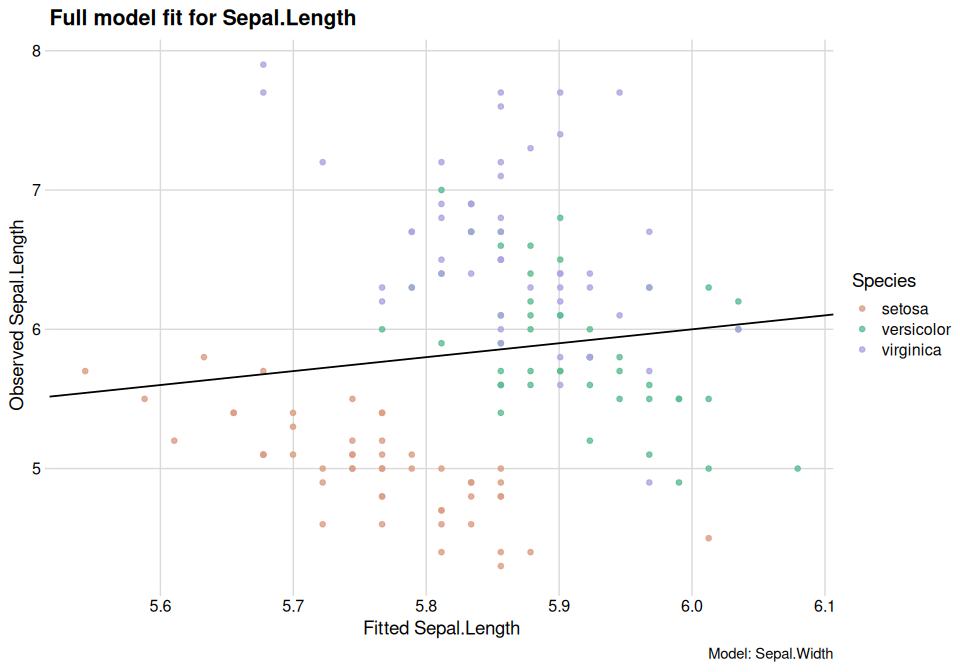

Or by by Petal.Length:

``` r
express_fit(lm_1, iris, by_covar = "Petal.Length")
```

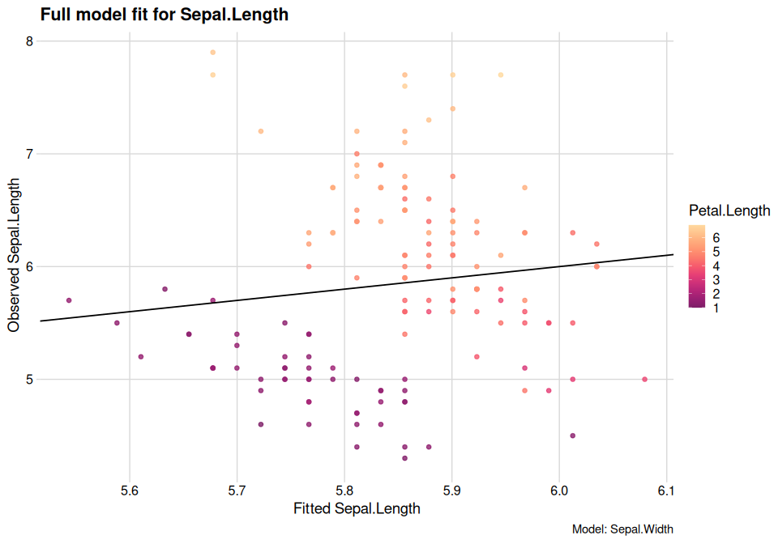

Or you can express the fit by both at once:

``` r
express_fit(lm_1, iris, by_factor = "Species", by_covar = "Petal.Length")
```

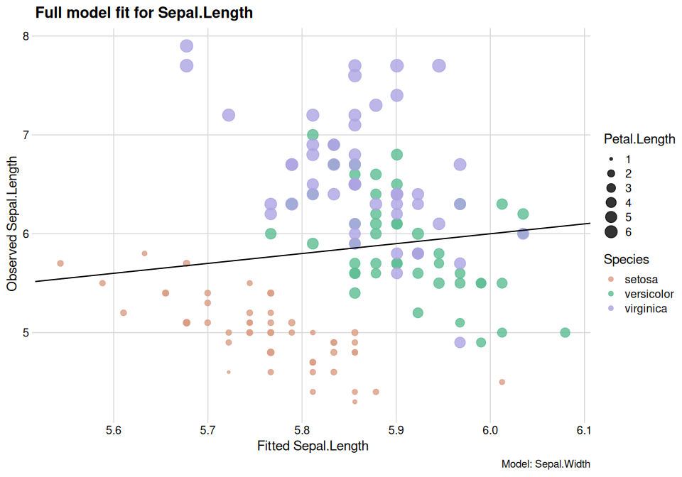

Beyond that, we can plot model diagnostics by Species:

``` r
express_eval(lm_1, iris, by_factor = "Species")
```

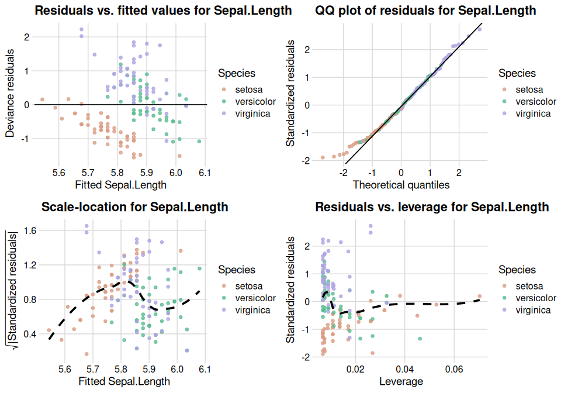

Or by Petal.Length:

``` r
express_eval(lm_1, iris, by_covar = "Petal.Length")
```

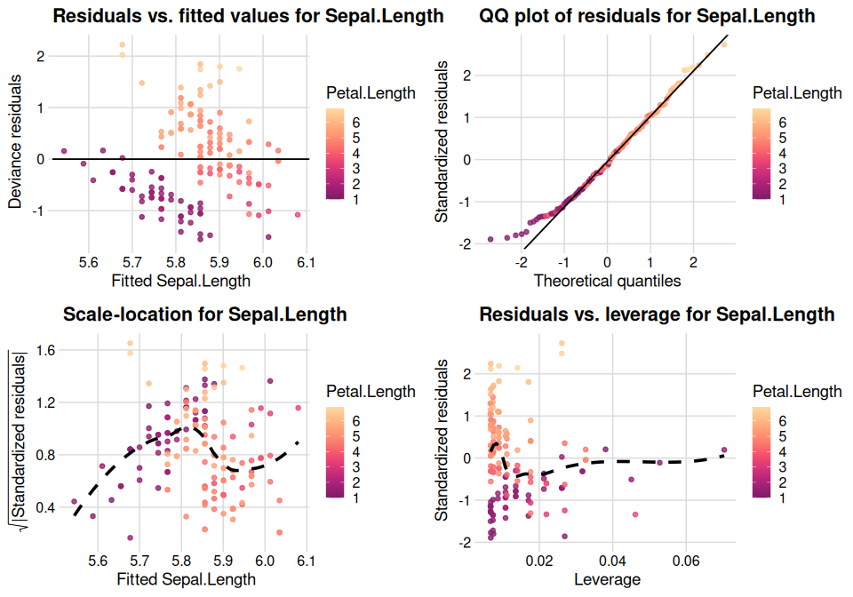

With `express_gauge()`, we can gauge potential missing parameters by
comparing model residuals to another variable. This will give you both a
plot and a summary of a diagnostic test for that relationship. For
example, compare the model residuals for `lm_1` by Species:

``` r
express_gauge(lm_1, iris, by_factor = "Species")
```

    ## $plots
    ## $plots$Sepal.Length_by_Species

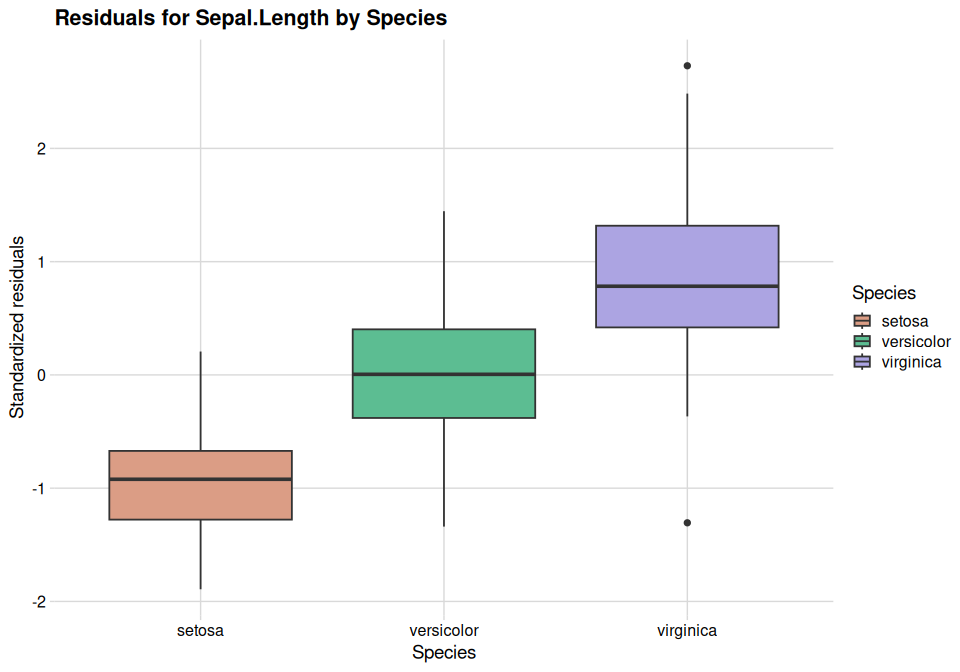

    ## 
    ## 
    ## $summaries
    ## $summaries$Sepal.Length_by_Species
    ##              Df Sum Sq Mean Sq F value Pr(>F)    
    ## Species       2  81.49   40.75   87.64 <2e-16 ***
    ## Residuals   147  68.35    0.46                   
    ## ---
    ## Signif. codes:  0 '***' 0.001 '**' 0.01 '*' 0.05 '.' 0.1 ' ' 1

Or gauge potential missing parameters by Petal.Length:

``` r
express_gauge(lm_1, iris, by_covar = "Petal.Length")
```

    ## $plots
    ## $plots$Sepal.Length_by_Petal.Length

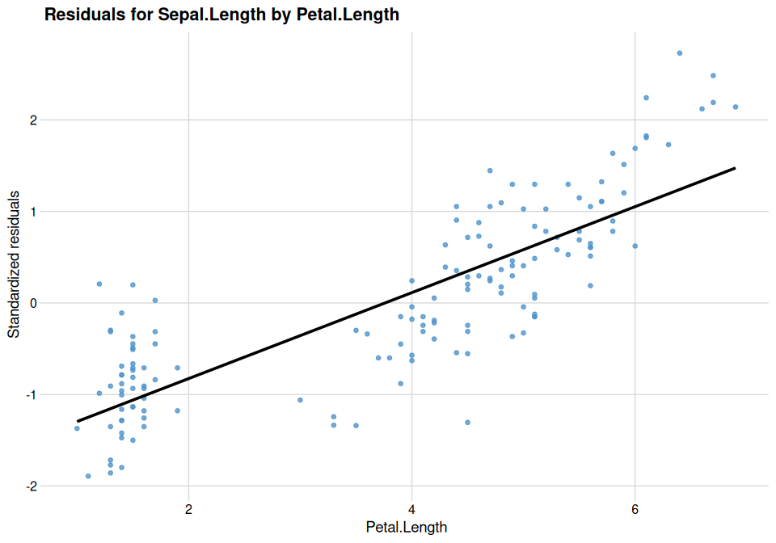

    ## 
    ## 
    ## $summaries
    ## $summaries$Sepal.Length_by_Petal.Length
    ## 
    ## Call:
    ## stats::lm(formula = stats::as.formula(transform), data = orig_data)
    ## 
    ## Residuals:
    ##      Min       1Q   Median       3Q      Max 
    ## -1.65355 -0.36206 -0.07436  0.37748  1.48942 
    ## 
    ## Coefficients:
    ##              Estimate Std. Error t value Pr(>|t|)    
    ## (Intercept)  -1.76574    0.10899  -16.20   <2e-16 ***
    ## Petal.Length  0.46968    0.02627   17.88   <2e-16 ***
    ## ---
    ## Signif. codes:  0 '***' 0.001 '**' 0.01 '*' 0.05 '.' 0.1 ' ' 1
    ## 
    ## Residual standard error: 0.566 on 148 degrees of freedom
    ## Multiple R-squared:  0.6836, Adjusted R-squared:  0.6815 
    ## F-statistic: 319.7 on 1 and 148 DF,  p-value: < 2.2e-16

Or, again, by both:

``` r
express_gauge(lm_1, iris, by_factor = "Species", by_covar = "Petal.Length")
```

    ## [1] "`.residual` ~ Petal.Length + (Petal.Length|Species)"

    ## boundary (singular) fit: see help('isSingular')

    ## $plots
    ## $plots$Sepal.Length_by_Species


    ## 
    ## $plots$Sepal.Length_by_Petal.Length

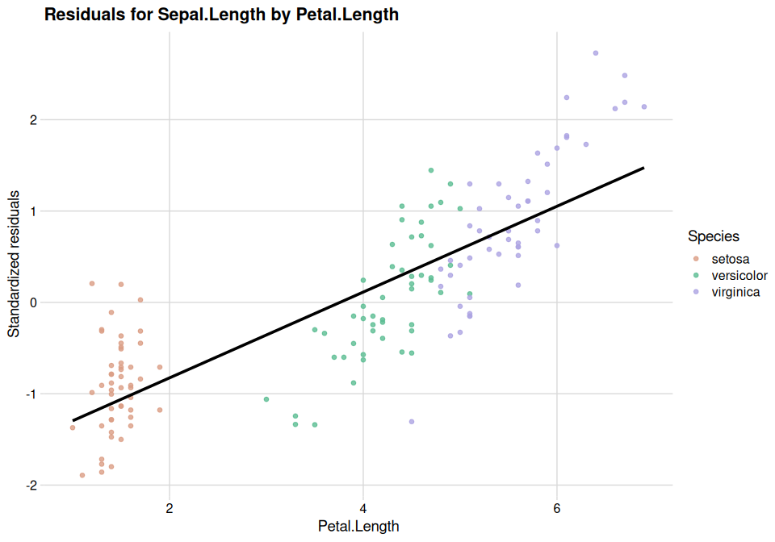

    ## 
    ## 
    ## $summaries
    ## $summaries$Sepal.Length_by_Species
    ##              Df Sum Sq Mean Sq F value Pr(>F)    
    ## Species       2  81.49   40.75   87.64 <2e-16 ***
    ## Residuals   147  68.35    0.46                   
    ## ---
    ## Signif. codes:  0 '***' 0.001 '**' 0.01 '*' 0.05 '.' 0.1 ' ' 1
    ## 
    ## $summaries$Sepal.Length_by_Petal.Length
    ## 
    ## Call:
    ## stats::lm(formula = stats::as.formula(transform), data = orig_data)
    ## 
    ## Residuals:
    ##      Min       1Q   Median       3Q      Max 
    ## -1.65355 -0.36206 -0.07436  0.37748  1.48942 
    ## 
    ## Coefficients:
    ##              Estimate Std. Error t value Pr(>|t|)    
    ## (Intercept)  -1.76574    0.10899  -16.20   <2e-16 ***
    ## Petal.Length  0.46968    0.02627   17.88   <2e-16 ***
    ## ---
    ## Signif. codes:  0 '***' 0.001 '**' 0.01 '*' 0.05 '.' 0.1 ' ' 1
    ## 
    ## Residual standard error: 0.566 on 148 degrees of freedom
    ## Multiple R-squared:  0.6836, Adjusted R-squared:  0.6815 
    ## F-statistic: 319.7 on 1 and 148 DF,  p-value: < 2.2e-16
    ## 
    ## 
    ## $summaries$Sepal.Length_by_Species_and_Petal.Length
    ## Linear mixed model fit by REML ['lmerMod']
    ## Formula: .residual ~ Petal.Length + (Petal.Length | Species)
    ##    Data: orig_data
    ## 
    ## REML criterion at convergence: 204
    ## 
    ## Scaled residuals: 
    ##      Min       1Q   Median       3Q      Max 
    ## -1.90219 -0.69958 -0.07863  0.60283  2.94782 
    ## 
    ## Random effects:
    ##  Groups   Name         Variance Std.Dev. Corr  
    ##  Species  (Intercept)  4.42768  2.1042         
    ##           Petal.Length 0.06838  0.2615   -1.00 
    ##  Residual              0.20278  0.4503         
    ## Number of obs: 150, groups:  Species, 3
    ## 
    ## Fixed effects:
    ##              Estimate Std. Error t value
    ## (Intercept)   -4.2369     1.2511  -3.387
    ## Petal.Length   1.0316     0.1656   6.230
    ## 
    ## Correlation of Fixed Effects:
    ##             (Intr)
    ## Petal.Lngth -0.983
    ## optimizer (nloptwrap) convergence code: 0 (OK)
    ## boundary (singular) fit: see help('isSingular')

------------------------------------------------------------------------

### More complex linear models

A univariate linear model is great, but what about multivariate linear
models, those with interactions, and inline functions? Let’s do a more
complex model with `exp()`, `I(x**2)`, and interaction terms.

``` r
lm_2 <- stats::lm(
  Sepal.Length ~ exp(Sepal.Width) + I(Petal.Length ** 2) + Sepal.Width * Petal.Length,
  data = iris
)
```

We can now express partial fits for each term. Expressing the partial
fit by Species for one term, `exp(Sepal.Width)`:

``` r
express_one(lm_2, iris, "exp(Sepal.Width)", by_factor = "Species")
```

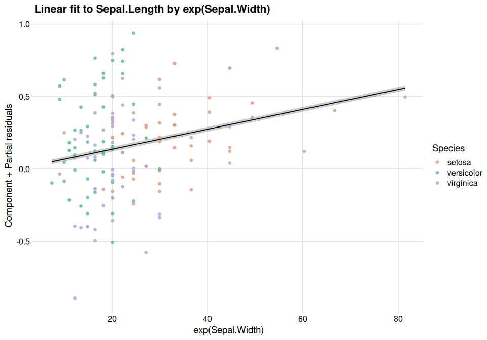

Or, we can express the partial fit by Petal.Width for another term,
e.g., the interaction between Sepal.Width and Petal.Length:

``` r
express_one(lm_2, iris, "Sepal.Width:Petal.Length", by_covar = "Petal.Width")
```

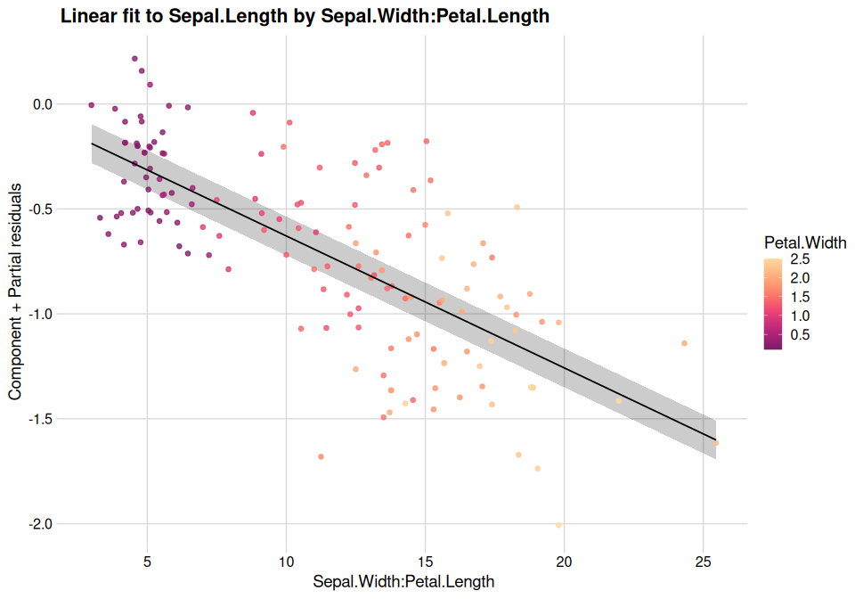

We can even do many terms at once, though this may crowd our plot if we
have many terms:

``` r
express_many(lm_2,
             iris,
             c("exp(Sepal.Width)", "Sepal.Width:Petal.Length"),
             by_factor = "Species")
```

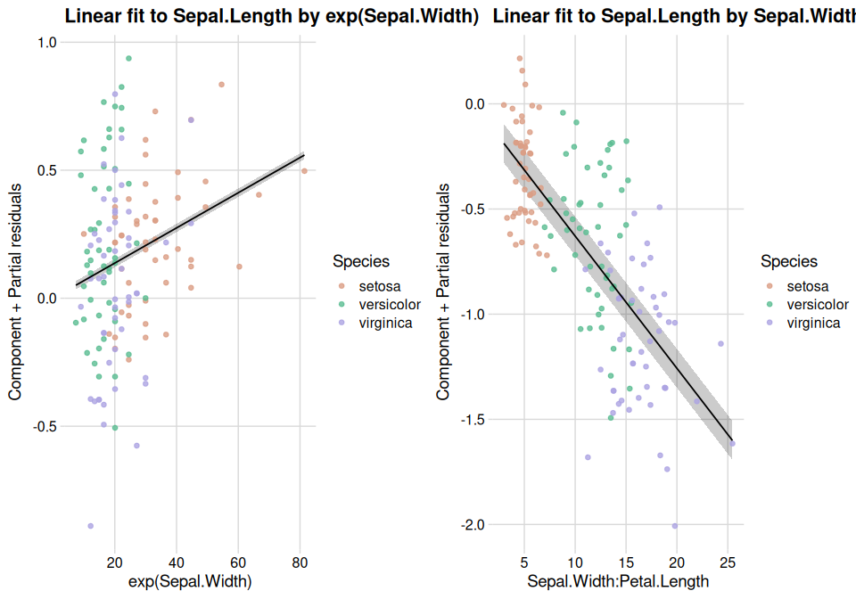

Or, if we specify nothing, all terms at once: The plot gets very busy
with all those terms! If you want them individually, try `grid = FALSE`.

``` r
express_many(lm_2, iris, by_covar = "Petal.Width")
```

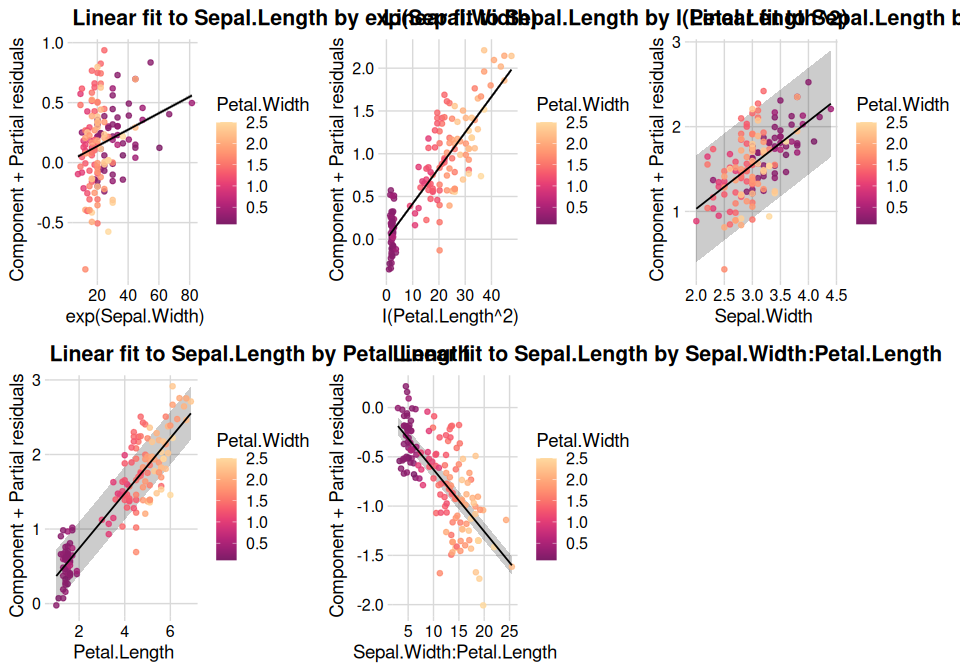

We can gauge potential missing parameters in the whole model by Species:

``` r
express_gauge(lm_2, iris, by_factor = "Species")
```

    ## $plots
    ## $plots$Sepal.Length_by_Species

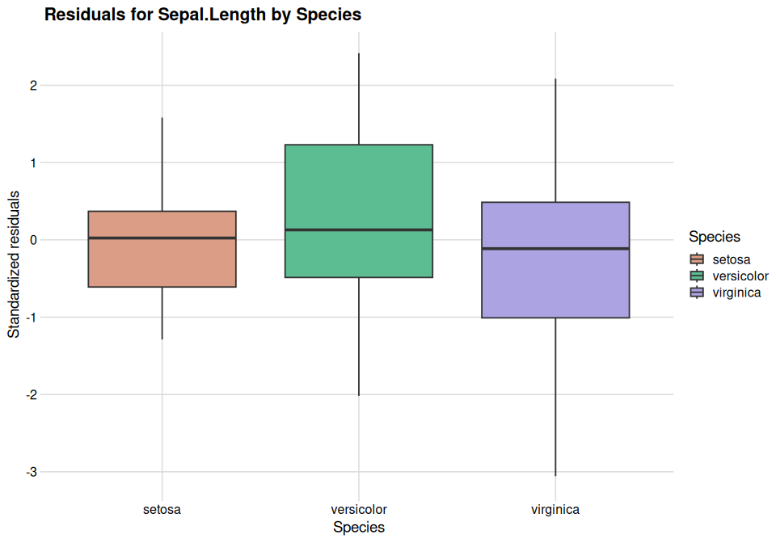

    ## 
    ## 
    ## $summaries
    ## $summaries$Sepal.Length_by_Species
    ##              Df Sum Sq Mean Sq F value  Pr(>F)   
    ## Species       2   9.15   4.573    4.81 0.00947 **
    ## Residuals   147 139.75   0.951                   
    ## ---
    ## Signif. codes:  0 '***' 0.001 '**' 0.01 '*' 0.05 '.' 0.1 ' ' 1

Or, now that we have multiple components, we can gauge potential missing
parameters by partial residuals for one component, `exp(Sepal.Width)` by
Species:

``` r
express_gaugepart(lm_2, iris, "exp(Sepal.Width)", by_factor = "Species")
```

    ## $plots
    ## $plots$`exp(Sepal.Width)_on_Sepal.Length_by_Species`

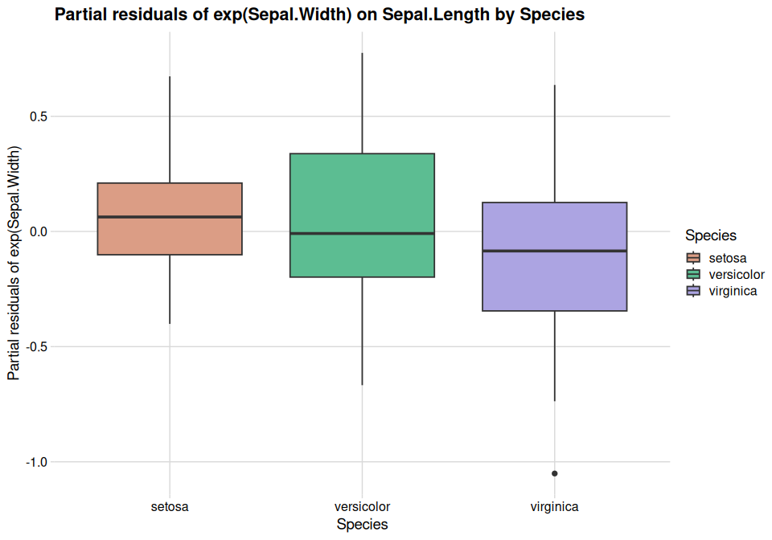

    ## 
    ## 
    ## $summaries
    ## $summaries$`exp(Sepal.Width)_on_Sepal.Length_by_Species`
    ##              Df Sum Sq Mean Sq F value  Pr(>F)   
    ## Species       2  0.983  0.4916   4.847 0.00916 **
    ## Residuals   147 14.910  0.1014                   
    ## ---
    ## Signif. codes:  0 '***' 0.001 '**' 0.01 '*' 0.05 '.' 0.1 ' ' 1

Or, again, if we leave the components blank, we get everything (notice
how long the summaries get once we use everything at once!). This time
by Petal.Length:

``` r
express_gaugepart(lm_2, iris, by_covar = "Petal.Length")
```

    ## $plots
    ## $plots$`exp(Sepal.Width)_on_Sepal.Length_by_Petal.Length`

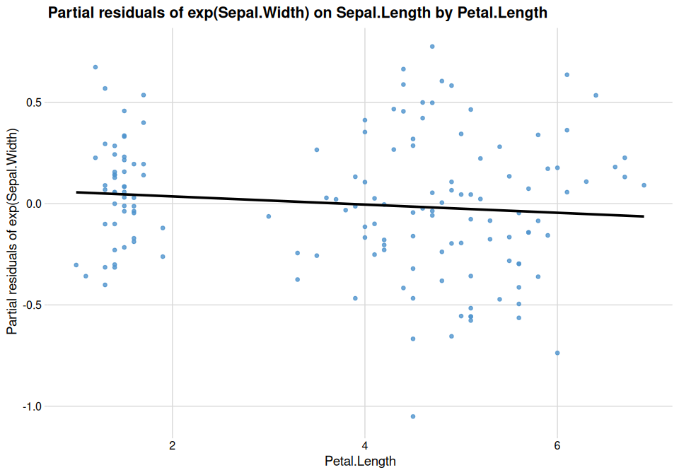

    ## 
    ## $plots$`I(Petal.Length^2)_on_Sepal.Length_by_Petal.Length`

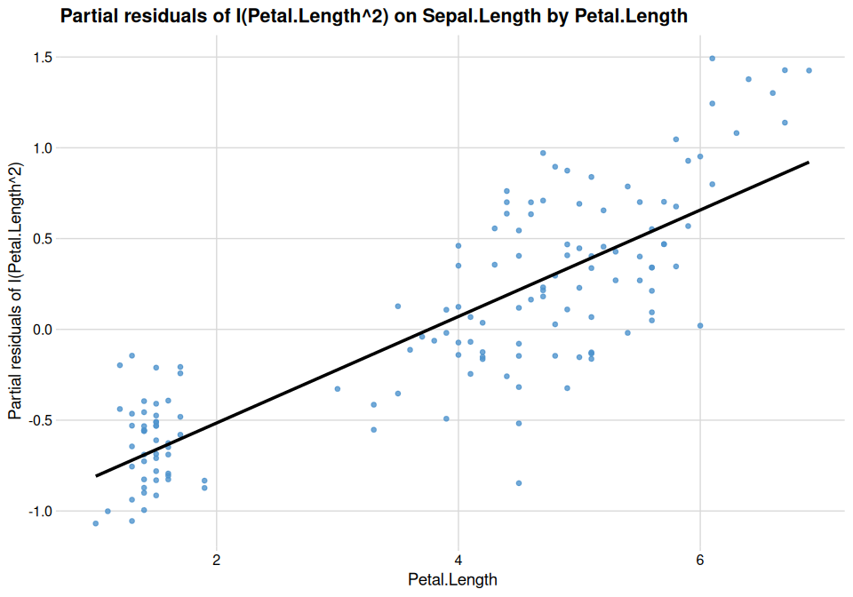

    ## 
    ## $plots$Sepal.Width_on_Sepal.Length_by_Petal.Length

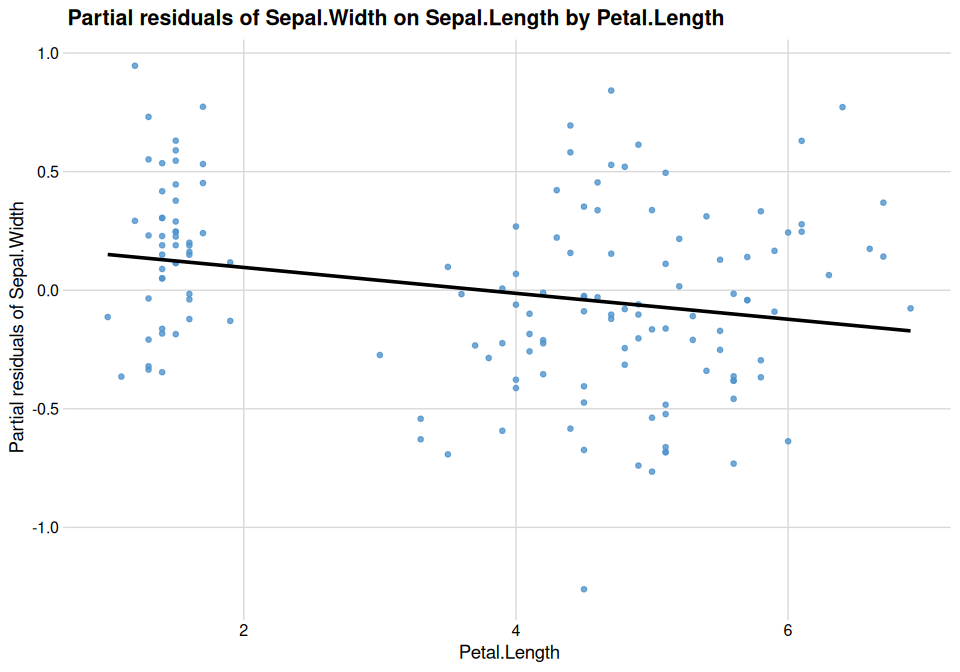

    ## 
    ## $plots$Petal.Length_on_Sepal.Length_by_Petal.Length

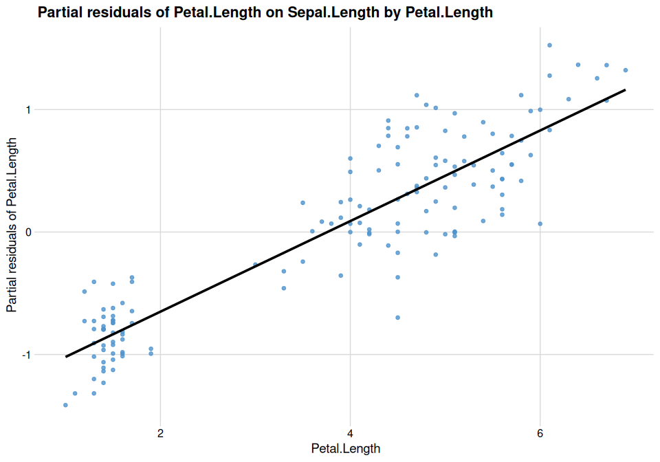

    ## 
    ## $plots$`Sepal.Width:Petal.Length_on_Sepal.Length_by_Petal.Length`

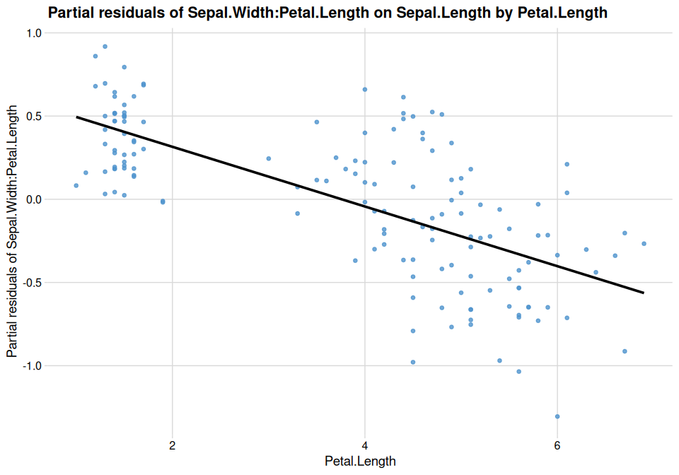

    ## 
    ## 
    ## $summaries
    ## $summaries$`exp(Sepal.Width)_on_Sepal.Length_by_Petal.Length`
    ## 
    ## Call:
    ## stats::lm(formula = stats::as.formula(transform), data = orig_data)
    ## 
    ## Residuals:
    ##      Min       1Q   Median       3Q      Max 
    ## -1.03589 -0.21912 -0.00097  0.19389  0.79453 
    ## 
    ## Coefficients:
    ##              Estimate Std. Error t value Pr(>|t|)
    ## (Intercept)   0.07591    0.06273   1.210    0.228
    ## Petal.Length -0.02020    0.01512  -1.336    0.184
    ## 
    ## Residual standard error: 0.3257 on 148 degrees of freedom
    ## Multiple R-squared:  0.01192,    Adjusted R-squared:  0.005244 
    ## F-statistic: 1.786 on 1 and 148 DF,  p-value: 0.1835
    ## 
    ## 
    ## $summaries$`I(Petal.Length^2)_on_Sepal.Length_by_Petal.Length`
    ## 
    ## Call:
    ## stats::lm(formula = stats::as.formula(transform), data = orig_data)
    ## 
    ## Residuals:
    ##      Min       1Q   Median       3Q      Max 
    ## -1.06453 -0.22114 -0.02421  0.23458  0.80557 
    ## 
    ## Coefficients:
    ##              Estimate Std. Error t value Pr(>|t|)    
    ## (Intercept)  -1.10188    0.06387  -17.25   <2e-16 ***
    ## Petal.Length  0.29321    0.01539   19.05   <2e-16 ***
    ## ---
    ## Signif. codes:  0 '***' 0.001 '**' 0.01 '*' 0.05 '.' 0.1 ' ' 1
    ## 
    ## Residual standard error: 0.3317 on 148 degrees of freedom
    ## Multiple R-squared:  0.7103, Adjusted R-squared:  0.7084 
    ## F-statistic: 362.9 on 1 and 148 DF,  p-value: < 2.2e-16
    ## 
    ## 
    ## $summaries$Sepal.Width_on_Sepal.Length_by_Petal.Length
    ## 
    ## Call:
    ## stats::lm(formula = stats::as.formula(transform), data = orig_data)
    ## 
    ## Residuals:
    ##      Min       1Q   Median       3Q      Max 
    ## -1.22046 -0.25714  0.01281  0.25354  0.91630 
    ## 
    ## Coefficients:
    ##              Estimate Std. Error t value Pr(>|t|)   
    ## (Intercept)   0.20520    0.07273   2.821  0.00544 **
    ## Petal.Length -0.05460    0.01753  -3.115  0.00221 **
    ## ---
    ## Signif. codes:  0 '***' 0.001 '**' 0.01 '*' 0.05 '.' 0.1 ' ' 1
    ## 
    ## Residual standard error: 0.3777 on 148 degrees of freedom
    ## Multiple R-squared:  0.06153,    Adjusted R-squared:  0.05519 
    ## F-statistic: 9.704 on 1 and 148 DF,  p-value: 0.002209
    ## 
    ## 
    ## $summaries$Petal.Length_on_Sepal.Length_by_Petal.Length
    ## 
    ## Call:
    ## stats::lm(formula = stats::as.formula(transform), data = orig_data)
    ## 
    ## Residuals:
    ##      Min       1Q   Median       3Q      Max 
    ## -0.97330 -0.20678  0.00106  0.18436  0.76829 
    ## 
    ## Coefficients:
    ##              Estimate Std. Error t value Pr(>|t|)    
    ## (Intercept)  -1.38988    0.06122  -22.70   <2e-16 ***
    ## Petal.Length  0.36985    0.01475   25.07   <2e-16 ***
    ## ---
    ## Signif. codes:  0 '***' 0.001 '**' 0.01 '*' 0.05 '.' 0.1 ' ' 1
    ## 
    ## Residual standard error: 0.3179 on 148 degrees of freedom
    ## Multiple R-squared:  0.8094, Adjusted R-squared:  0.8081 
    ## F-statistic: 628.5 on 1 and 148 DF,  p-value: < 2.2e-16
    ## 
    ## 
    ## $summaries$`Sepal.Width:Petal.Length_on_Sepal.Length_by_Petal.Length`
    ## 
    ## Call:
    ## stats::lm(formula = stats::as.formula(transform), data = orig_data)
    ## 
    ## Residuals:
    ##     Min      1Q  Median      3Q     Max 
    ## -0.9032 -0.2391  0.0118  0.2172  0.7288 
    ## 
    ## Coefficients:
    ##              Estimate Std. Error t value Pr(>|t|)    
    ## (Intercept)   0.67393    0.06369   10.58   <2e-16 ***
    ## Petal.Length -0.17933    0.01535  -11.68   <2e-16 ***
    ## ---
    ## Signif. codes:  0 '***' 0.001 '**' 0.01 '*' 0.05 '.' 0.1 ' ' 1
    ## 
    ## Residual standard error: 0.3307 on 148 degrees of freedom
    ## Multiple R-squared:  0.4798, Adjusted R-squared:  0.4763 
    ## F-statistic: 136.5 on 1 and 148 DF,  p-value: < 2.2e-16

------------------------------------------------------------------------

### Simple univariate GAM

Note that the `control = list(keepData = TRUE)` in a GAM object allows
you to not have to specify the original data every time. Let’s start
with a univariate GAM.

``` r
gam_1 <- mgcv::gam(
  Sepal.Length ~ s(Sepal.Width),
  method = "REML",
  data = iris,
  control = list(keepData = TRUE)
)
```

Searching through GAM terms works by partial matching. Let’s plot the
component containing “Sepal” by Species:

``` r
express_one(gam_1, "Sepal", by_factor = "Species")
```

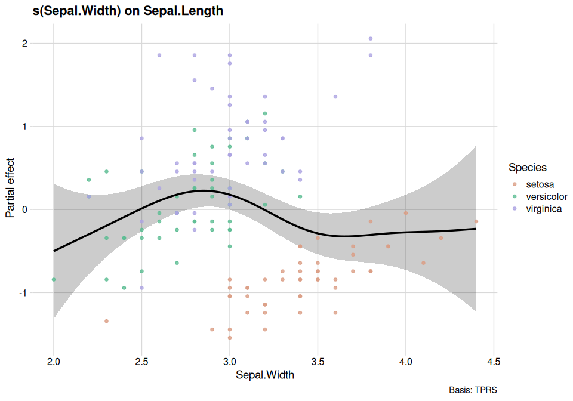

We can evaluate, too, by e.g., Petal.Width. Note that it will tell you
that splitting histograms by a covariate is unsupported.

``` r
express_eval(gam_1, by_covar = "Petal.Width")
```

    ## Cannot facet histogram by a continuous variable.
    ## A histogram or histograms will be returned without splitting by a covariate.

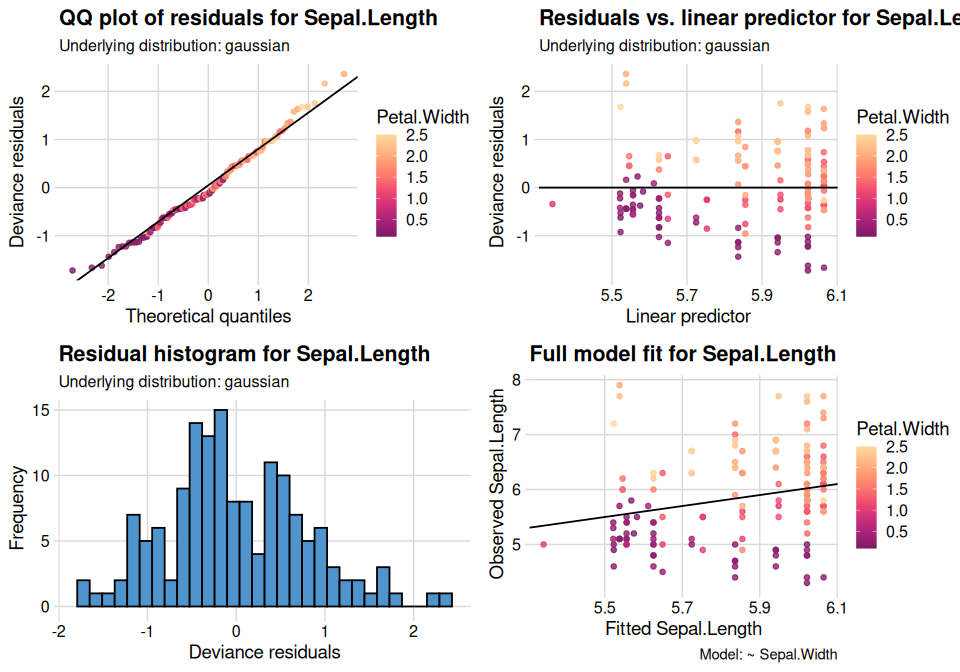

### More complex GAM

How about a GAM with more terms? Note the control parameter as above.

``` r
gam_2 <- mgcv::gam(
  Sepal.Length ~ s(Sepal.Width) + s(Petal.Length) + ti(Sepal.Width, Petal.Length),
  method = "REML",
  data = iris,
  control = list(keepData = TRUE)
)
```

It is possible to express single and multivariate smooths. For example,
express the s(Petal.Length) term by Species:

``` r
express_one(gam_2, "s,Petal", by_factor = "Species")
```

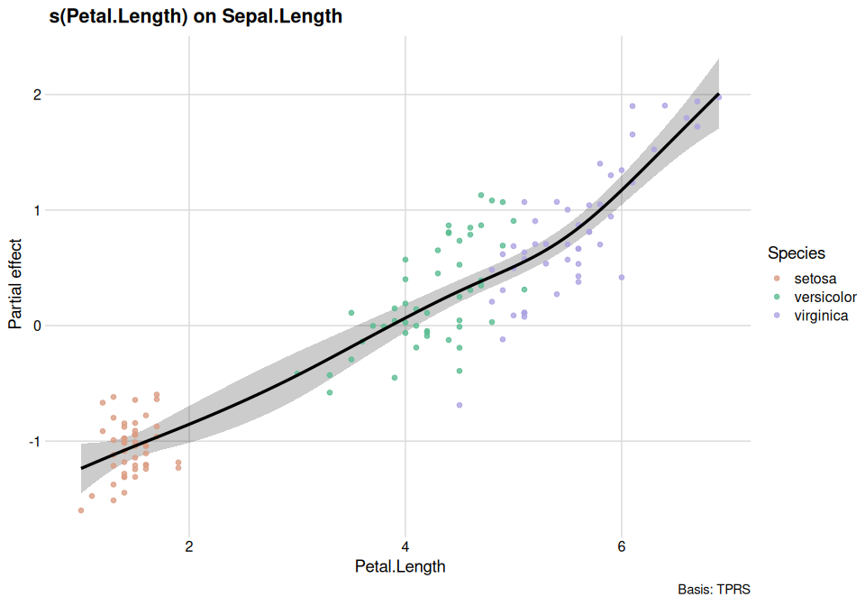

The ti(Sepal.Width, Petal.Length) term is bivariate. This can also be
expressed:

``` r
express_one(gam_2, "ti,Se,Pe", by_factor = "Species")
```

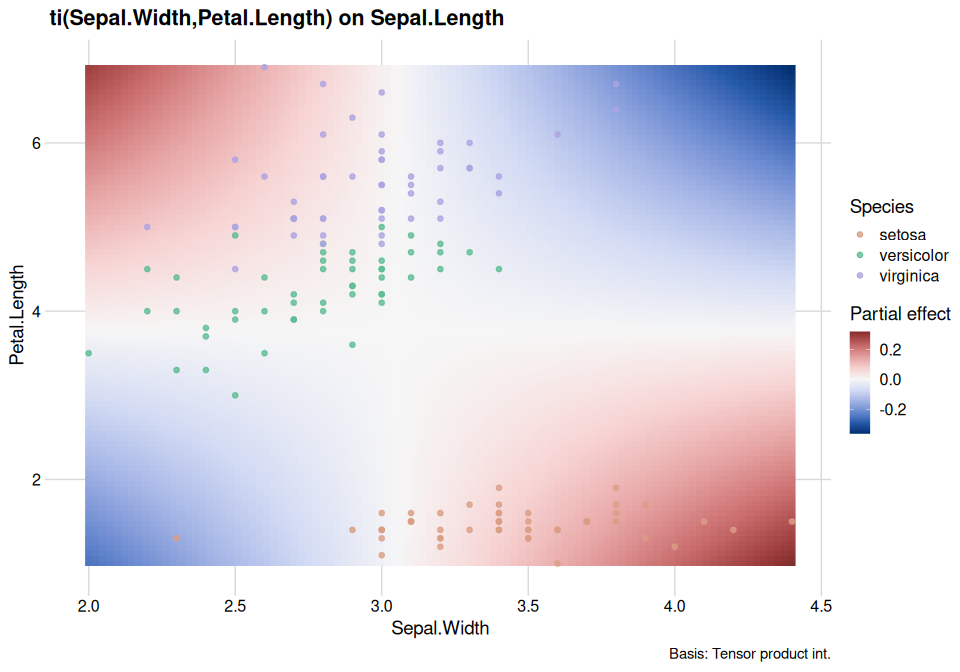

Or, again, if left blank, it will express everything (here, by
Petal.Width):

``` r
express_many(gam_2, by_covar = "Petal.Width")
```

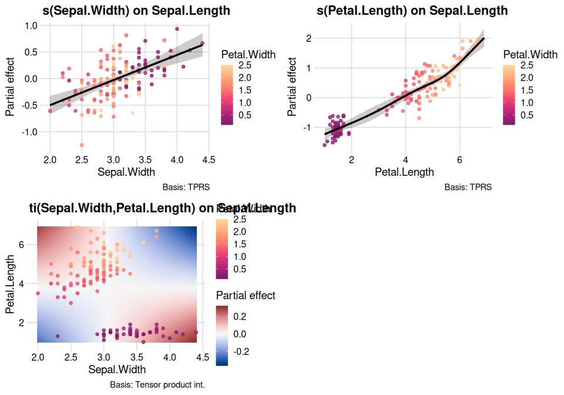

We can gauge potential missing parameters by Species:

``` r
express_gauge(gam_2, by_factor = "Species")
```

    ## $plots
    ## $plots$Sepal.Length_by_Species

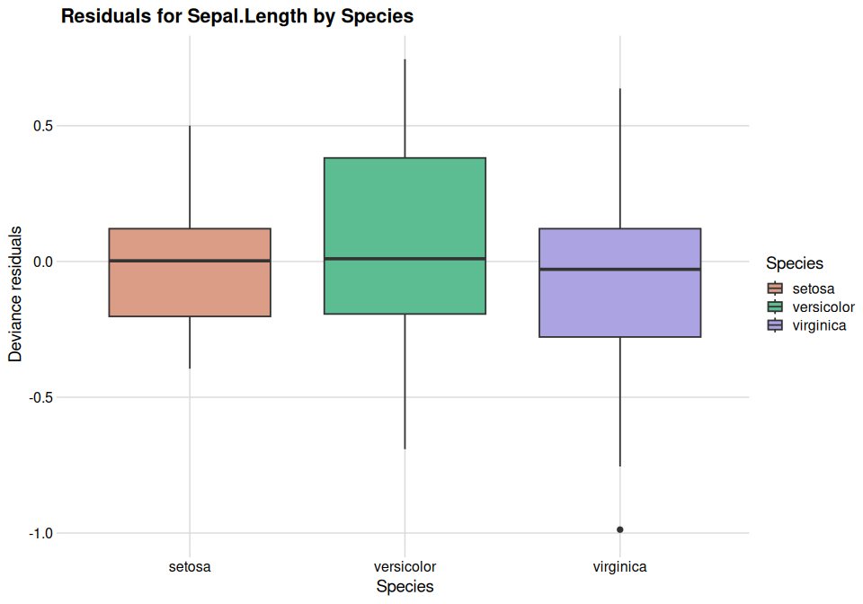

    ## 
    ## 
    ## $summaries
    ## $summaries$Sepal.Length_by_Species
    ##              Df Sum Sq Mean Sq F value Pr(>F)  
    ## Species       2  0.476 0.23812   2.555 0.0812 .
    ## Residuals   147 13.702 0.09321                 
    ## ---
    ## Signif. codes:  0 '***' 0.001 '**' 0.01 '*' 0.05 '.' 0.1 ' ' 1

Or, by component, we can gauge potential missing parameters by partial
residuals:

``` r
express_gaugepart(gam_2, "s,Se", by_factor = "Species")
```

    ## $plots
    ## $plots$`s(Sepal.Width)_on_Sepal.Length_by_Species`


    ## 
    ## 
    ## $summaries
    ## $summaries$`s(Sepal.Width)_on_Sepal.Length_by_Species`
    ##              Df Sum Sq Mean Sq F value   Pr(>F)    
    ## Species       2  2.334  1.1669   9.461 0.000136 ***
    ## Residuals   147 18.132  0.1233                     
    ## ---
    ## Signif. codes:  0 '***' 0.001 '**' 0.01 '*' 0.05 '.' 0.1 ' ' 1

And again for many or all components:

``` r
express_gaugepart(gam_2, by_factor = "Species")
```

    ## $plots
    ## $plots$`s(Sepal.Width)_on_Sepal.Length_by_Species`

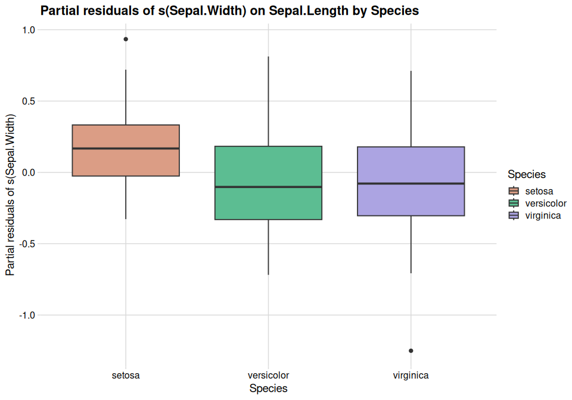

    ## 
    ## $plots$`s(Petal.Length)_on_Sepal.Length_by_Species`

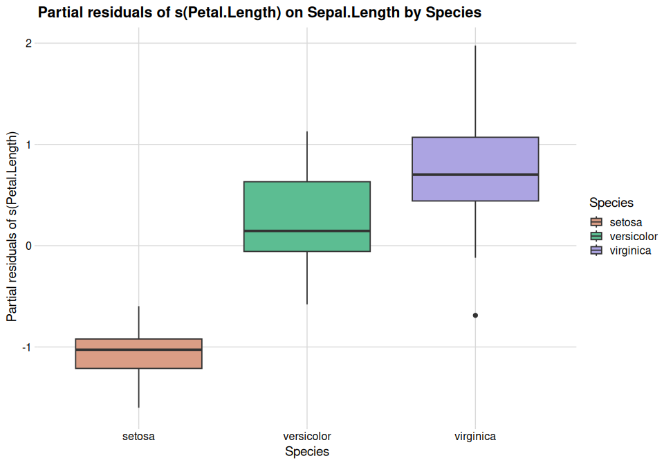

    ## 
    ## $plots$`ti(Sepal.Width,Petal.Length)_on_Sepal.Length_by_Species`

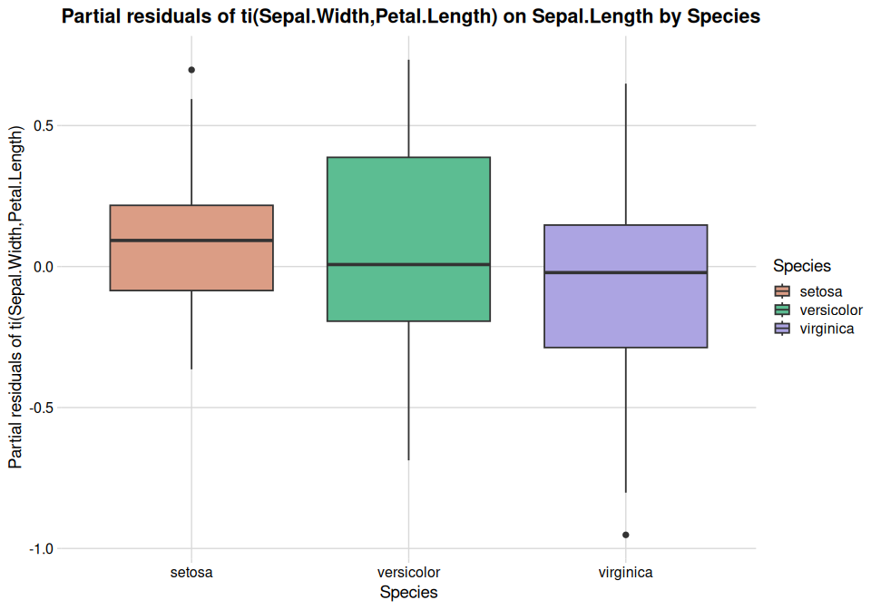

    ## 
    ## 
    ## $summaries
    ## $summaries$`s(Sepal.Width)_on_Sepal.Length_by_Species`
    ##              Df Sum Sq Mean Sq F value   Pr(>F)    
    ## Species       2  2.334  1.1669   9.461 0.000136 ***
    ## Residuals   147 18.132  0.1233                     
    ## ---
    ## Signif. codes:  0 '***' 0.001 '**' 0.01 '*' 0.05 '.' 0.1 ' ' 1
    ## 
    ## $summaries$`s(Petal.Length)_on_Sepal.Length_by_Species`
    ##              Df Sum Sq Mean Sq F value Pr(>F)    
    ## Species       2  91.35   45.68     226 <2e-16 ***
    ## Residuals   147  29.71    0.20                   
    ## ---
    ## Signif. codes:  0 '***' 0.001 '**' 0.01 '*' 0.05 '.' 0.1 ' ' 1
    ## 
    ## $summaries$`ti(Sepal.Width,Petal.Length)_on_Sepal.Length_by_Species`
    ##              Df Sum Sq Mean Sq F value Pr(>F)  
    ## Species       2  0.613 0.30663   3.182 0.0444 *
    ## Residuals   147 14.167 0.09638                 
    ## ---
    ## Signif. codes:  0 '***' 0.001 '**' 0.01 '*' 0.05 '.' 0.1 ' ' 1

### GAM with random effect smooth (hierarchical GAM)

``` r
gam_3 <- mgcv::gam(
  Sepal.Length ~ s(Sepal.Width) + s(Species, bs = "re"),
  method = "REML",
  data = iris,
  control = list(keepData = TRUE)
)
```

Let’s see how the random effect gets plotted. What happens here is that
the mean value for a continuous variable is taken for each level in the
random effect.

``` r
express_one(gam_3, "Spec", by_covar = "Petal.Width")
```

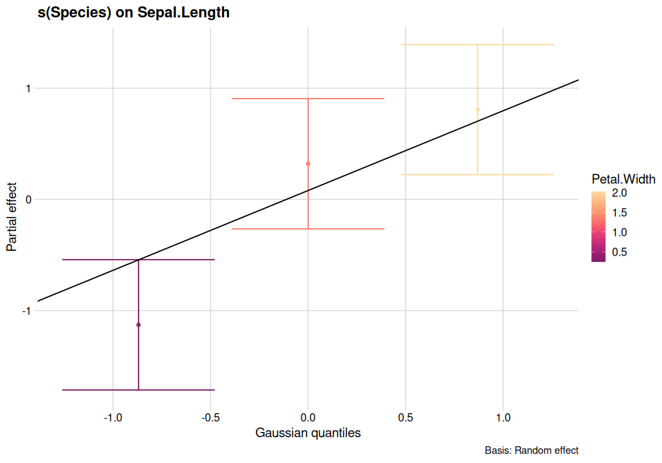

We can do model evaluations on GAMs:

``` r
express_eval(gam_3, by_covar = "Petal.Width")
```

    ## Cannot facet histogram by a continuous variable.
    ## A histogram or histograms will be returned without splitting by a covariate.

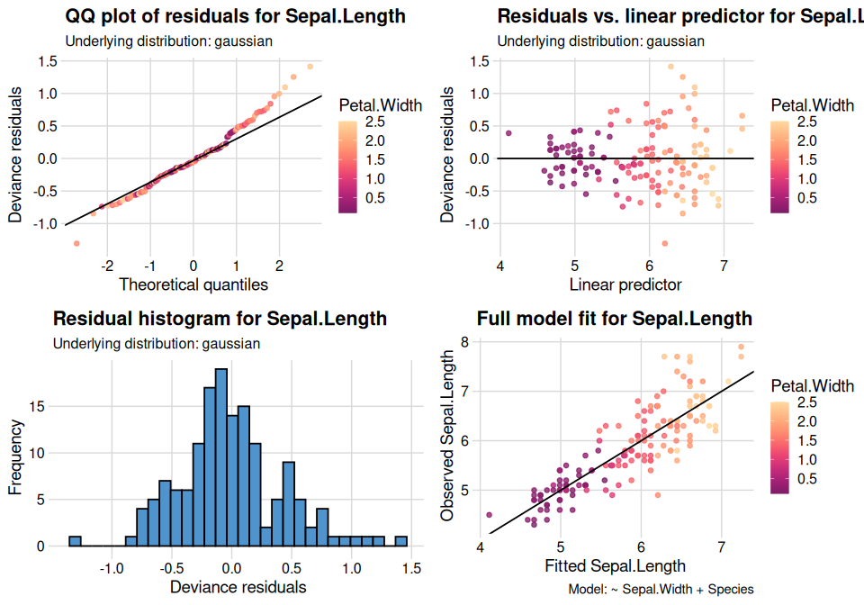

And gauge potential missing effects:

``` r
express_gauge(gam_3, by_covar = "Petal.Width")
```

    ## $plots
    ## $plots$Sepal.Length_by_Petal.Width

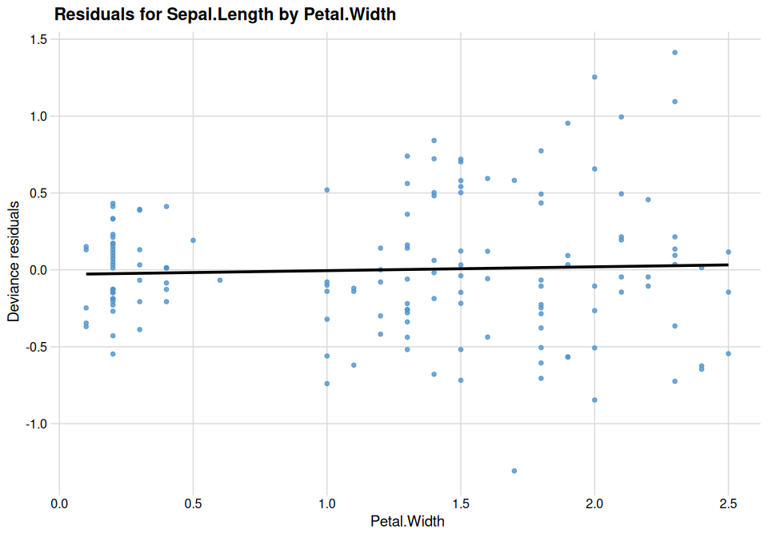

    ## 
    ## 
    ## $summaries
    ## $summaries$Sepal.Length_by_Petal.Width
    ## 
    ## Call:
    ## stats::lm(formula = stats::as.formula(transform), data = orig_data)
    ## 
    ## Residuals:
    ##     Min      1Q  Median      3Q     Max 
    ## -1.3195 -0.2569 -0.0577  0.1953  1.3859 
    ## 
    ## Coefficients:
    ##             Estimate Std. Error t value Pr(>|t|)
    ## (Intercept) -0.02975    0.06631  -0.449    0.654
    ## Petal.Width  0.02481    0.04671   0.531    0.596
    ## 
    ## Residual standard error: 0.4346 on 148 degrees of freedom
    ## Multiple R-squared:  0.001902,   Adjusted R-squared:  -0.004842 
    ## F-statistic: 0.2821 on 1 and 148 DF,  p-value: 0.5961

### GAM with a non-tensor multivariate smooth

For a GAM with a non-tensor multivariate smooth, note that it
essentially works the same as the tensor product smooths.

``` r
gam_4 <- mgcv::gam(
  Sepal.Length ~ s(Sepal.Width, Petal.Length),
  method = "REML",
  data = iris,
  control = list(keepData = TRUE)
)
```

This is what that looks like:

``` r
express_many(gam_4)
```

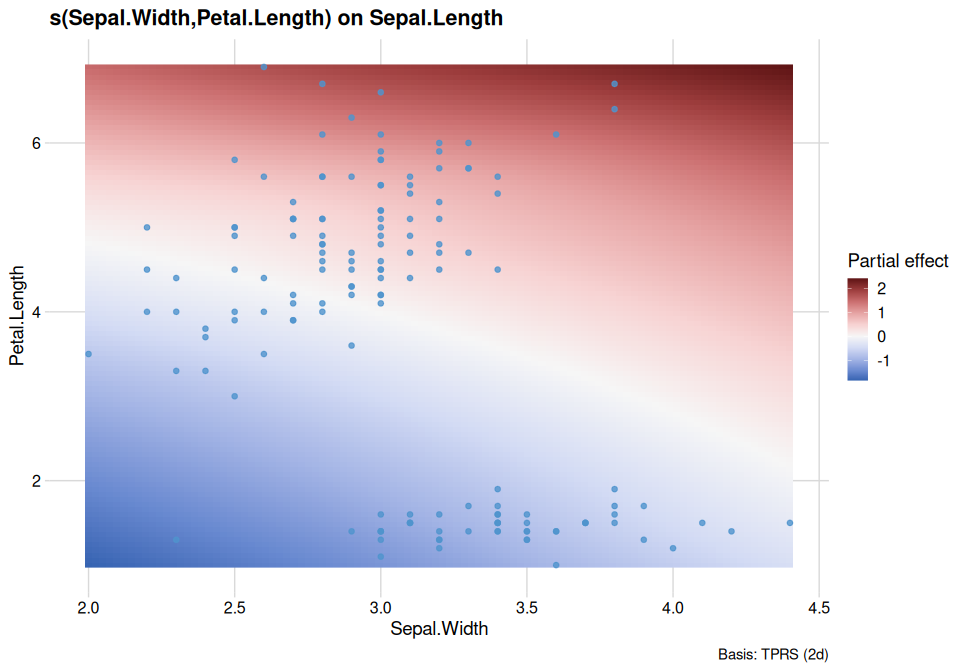

We can also do this for factor smooths (`bs = "fs"`):

``` r
gam_5 <- mgcv::gam(
  Sepal.Length ~ s(Sepal.Width, Species, bs = "fs"),
  method = "REML",
  data = iris,
  control = list(keepData = TRUE)
)
```

Note how the factor smooth will show a separate effect for each level of
the smooth:

``` r
express_many(gam_5)
```

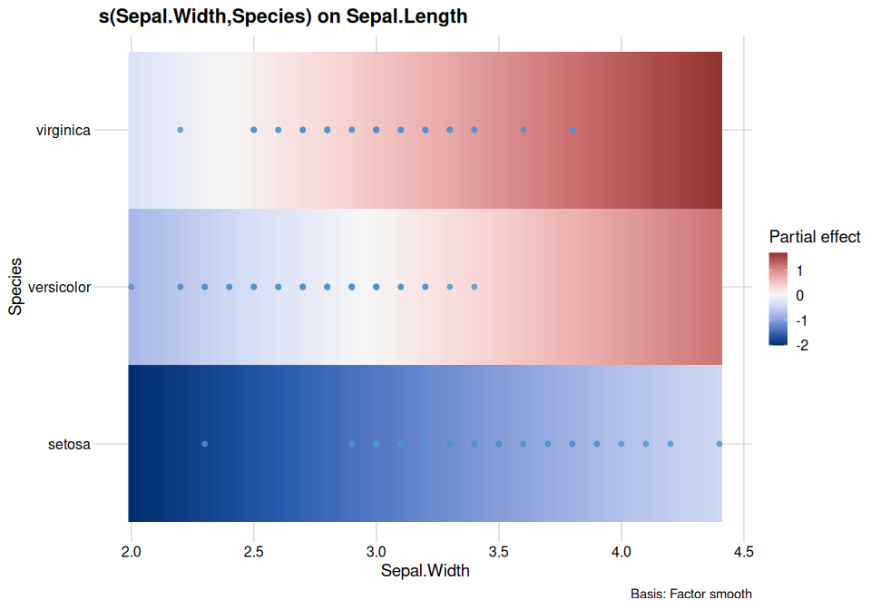

The model diagnostics look mostly the same:

``` r
express_eval(gam_5)
```

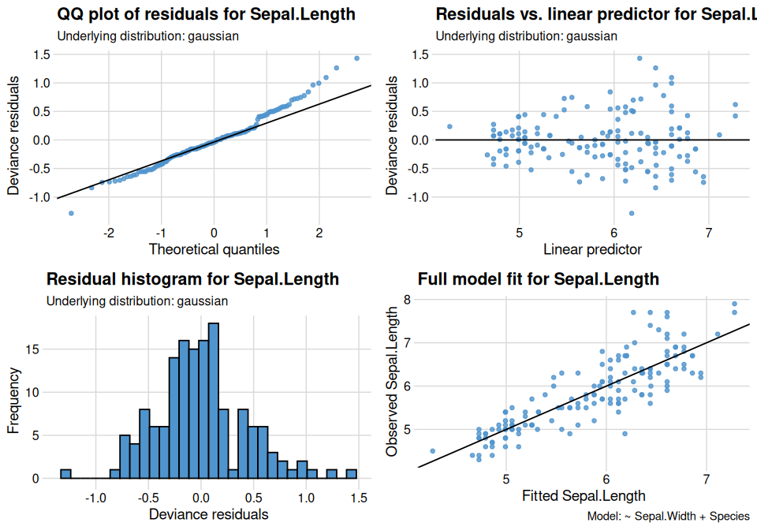

------------------------------------------------------------------------

### Simple GLMs

Just to test, we can create an inverse-gaussian log-linked GLM. This is
probably not the right fit for the data, but it is useful for testing.

``` r
glm_1 <- stats::glm(Sepal.Length ~ Sepal.Width,
                    data = iris,
                    family = inverse.gaussian(link = "log"))
```

We can also create one with a binomial logit-linked GLM, because that
will probably look quite different.

``` r
glm_2 <- stats::glm(vs ~ wt + disp,
                    data = mtcars,
                    family = binomial(link = "logit"))
```

GLM objects contain the full data on which they were built. This means
we do not need to pass the `data` parameter at all. This means however
that we do need to feed something to `data` when making the model.

Note that the shapes are off for a lot of the plots for a binomial
distribution. However, this is also true for the base `plot.glm` method.

``` r
express_eval(glm_2)
```

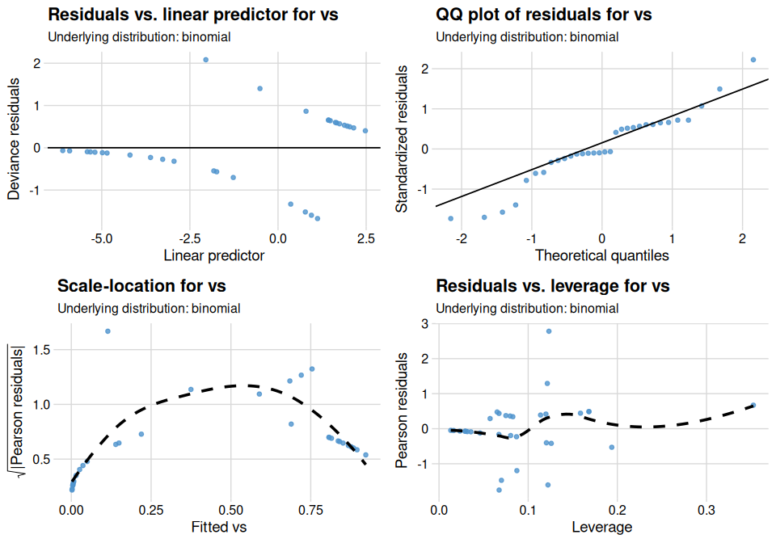

``` r
express_gauge(glm_1, by_factor = "Species")
```

    ## $plots
    ## $plots$Sepal.Length_by_Species

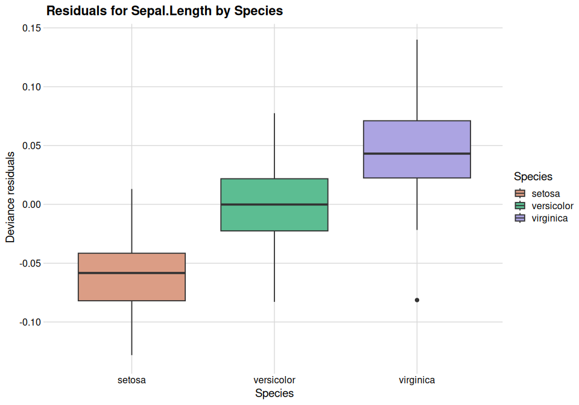

    ## 
    ## 
    ## $summaries
    ## $summaries$Sepal.Length_by_Species
    ##              Df Sum Sq Mean Sq F value Pr(>F)    
    ## Species       2 0.2801 0.14007    92.5 <2e-16 ***
    ## Residuals   147 0.2226 0.00151                   
    ## ---
    ## Signif. codes:  0 '***' 0.001 '**' 0.01 '*' 0.05 '.' 0.1 ' ' 1

### More complex GLMs

Let’s try the same inverse-gaussian GLM, but with more terms, like an
interaction between Sepal.Width and Petal.Length.

``` r
glm_3 <- stats::glm(Sepal.Length ~ Sepal.Width * Petal.Length,
                    data = iris,
                    family = inverse.gaussian(link = "log"))
```

Expressing all components by Species:

``` r
express_many(glm_3, by_factor = "Species")
```

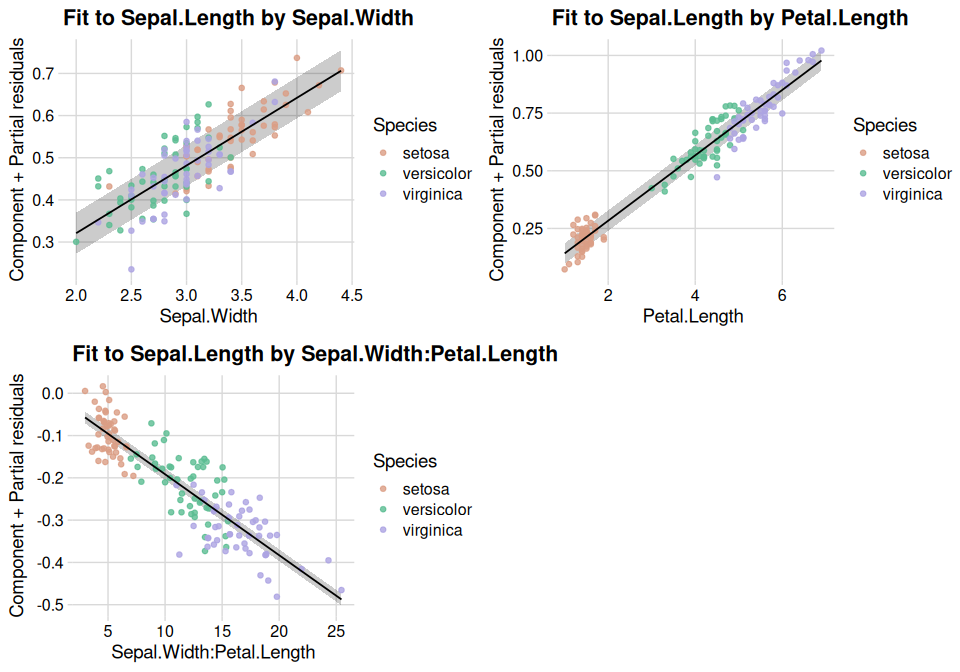

Gauging by individual parts for the complex model, by Species and
Petal.Width: It will tell us that the fit is singular, and that comes
from an LMM that is actually being fit to show the correlation between
Petal.Width and our model residuals, with a random slope and intercept
of Species.

``` r
express_gaugepart(glm_3, by_factor = "Species", by_covar = "Petal.Width")
```

    ## [1] "`partial_resids` ~ Petal.Width + (Petal.Width|Species)"

    ## boundary (singular) fit: see help('isSingular')

    ## [1] "`partial_resids` ~ Petal.Width + (Petal.Width|Species)"

    ## boundary (singular) fit: see help('isSingular')

    ## [1] "`partial_resids` ~ Petal.Width + (Petal.Width|Species)"

    ## boundary (singular) fit: see help('isSingular')

    ## $plots
    ## $plots$Sepal.Width_on_Sepal.Length_by_Species

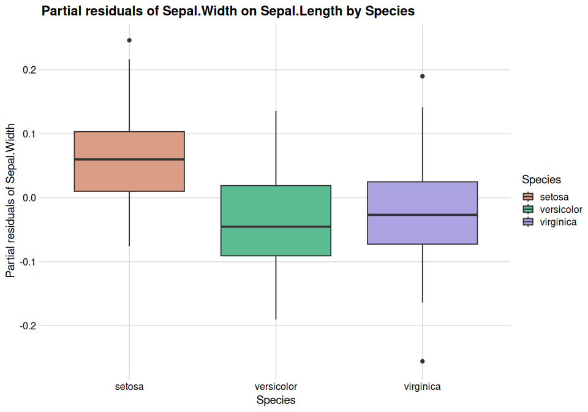

    ## 
    ## $plots$Sepal.Width_on_Sepal.Length_by_Petal.Width

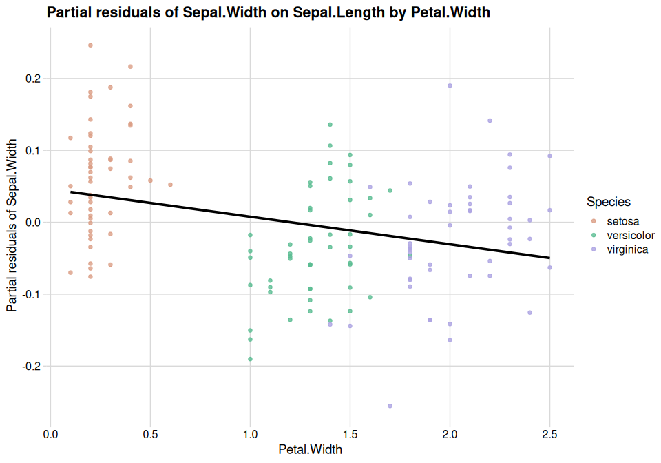

    ## 
    ## $plots$Petal.Length_on_Sepal.Length_by_Species

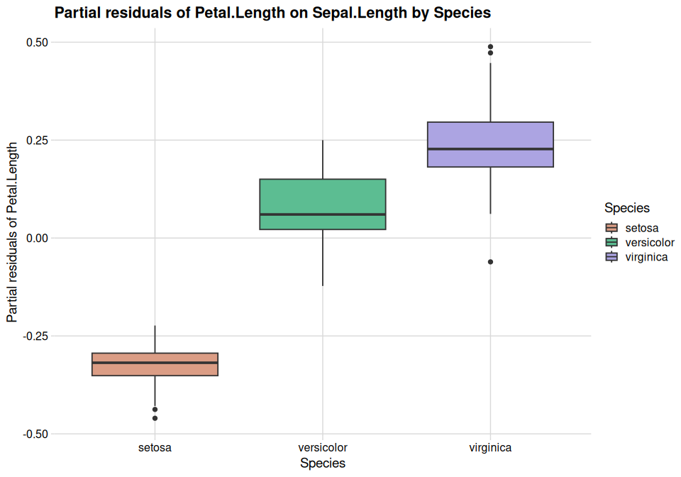

    ## 
    ## $plots$Petal.Length_on_Sepal.Length_by_Petal.Width

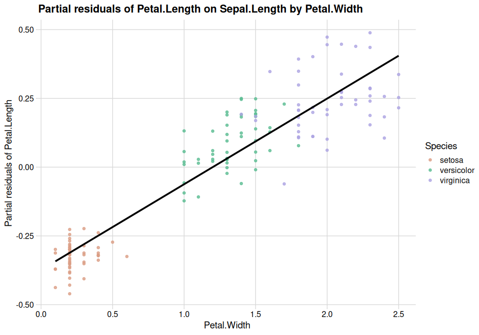

    ## 
    ## $plots$`Sepal.Width:Petal.Length_on_Sepal.Length_by_Species`

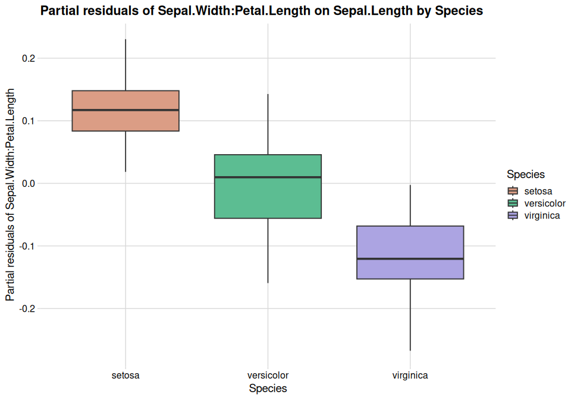

    ## 
    ## $plots$`Sepal.Width:Petal.Length_on_Sepal.Length_by_Petal.Width`

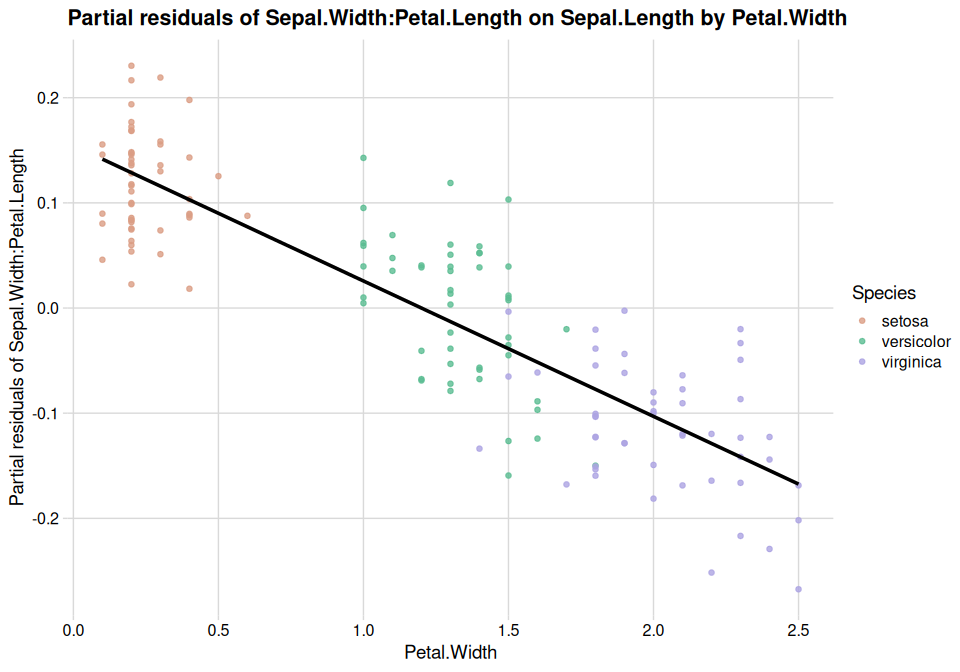

    ## 
    ## 
    ## $summaries
    ## $summaries$Sepal.Width_on_Sepal.Length_by_Species
    ##              Df Sum Sq Mean Sq F value   Pr(>F)    
    ## Species       2 0.2756 0.13778    22.9 2.19e-09 ***
    ## Residuals   147 0.8843 0.00602                     
    ## ---
    ## Signif. codes:  0 '***' 0.001 '**' 0.01 '*' 0.05 '.' 0.1 ' ' 1
    ## 
    ## $summaries$Sepal.Width_on_Sepal.Length_by_Petal.Width
    ## 
    ## Call:
    ## stats::lm(formula = stats::as.formula(transform), data = orig_data)
    ## 
    ## Residuals:
    ##       Min        1Q    Median        3Q       Max 
    ## -0.236380 -0.054997 -0.008087  0.054505  0.220556 
    ## 
    ## Coefficients:
    ##              Estimate Std. Error t value Pr(>|t|)    
    ## (Intercept)  0.045956   0.012747   3.605 0.000426 ***
    ## Petal.Width -0.038289   0.008979  -4.264 3.56e-05 ***
    ## ---
    ## Signif. codes:  0 '***' 0.001 '**' 0.01 '*' 0.05 '.' 0.1 ' ' 1
    ## 
    ## Residual standard error: 0.08354 on 148 degrees of freedom
    ## Multiple R-squared:  0.1094, Adjusted R-squared:  0.1034 
    ## F-statistic: 18.19 on 1 and 148 DF,  p-value: 3.557e-05
    ## 
    ## 
    ## $summaries$Sepal.Width_on_Sepal.Length_by_Species_and_Petal.Width
    ## Linear mixed model fit by REML ['lmerMod']
    ## Formula: partial_resids ~ Petal.Width + (Petal.Width | Species)
    ##    Data: orig_data
    ## 
    ## REML criterion at convergence: -337.5
    ## 
    ## Scaled residuals: 
    ##      Min       1Q   Median       3Q      Max 
    ## -2.63251 -0.64722  0.03278  0.62766  2.99063 
    ## 
    ## Random effects:
    ##  Groups   Name        Variance  Std.Dev. Corr 
    ##  Species  (Intercept) 0.0240971 0.15523       
    ##           Petal.Width 0.0002146 0.01465  1.00 
    ##  Residual             0.0052992 0.07280       
    ## Number of obs: 150, groups:  Species, 3
    ## 
    ## Fixed effects:
    ##             Estimate Std. Error t value
    ## (Intercept) -0.14931    0.09614  -1.553
    ## Petal.Width  0.13160    0.03090   4.259
    ## 
    ## Correlation of Fixed Effects:
    ##             (Intr)
    ## Petal.Width -0.088
    ## optimizer (nloptwrap) convergence code: 0 (OK)
    ## boundary (singular) fit: see help('isSingular')
    ## 
    ## 
    ## $summaries$Petal.Length_on_Sepal.Length_by_Species
    ##              Df Sum Sq Mean Sq F value Pr(>F)    
    ## Species       2  8.549   4.274   506.7 <2e-16 ***
    ## Residuals   147  1.240   0.008                   
    ## ---
    ## Signif. codes:  0 '***' 0.001 '**' 0.01 '*' 0.05 '.' 0.1 ' ' 1
    ## 
    ## $summaries$Petal.Length_on_Sepal.Length_by_Petal.Width
    ## 
    ## Call:
    ## stats::lm(formula = stats::as.formula(transform), data = orig_data)
    ## 
    ## Residuals:
    ##      Min       1Q   Median       3Q      Max 
    ## -0.26808 -0.06488 -0.00446  0.05982  0.22337 
    ## 
    ## Coefficients:
    ##             Estimate Std. Error t value Pr(>|t|)    
    ## (Intercept) -0.37346    0.01480  -25.23   <2e-16 ***
    ## Petal.Width  0.31142    0.01043   29.86   <2e-16 ***
    ## ---
    ## Signif. codes:  0 '***' 0.001 '**' 0.01 '*' 0.05 '.' 0.1 ' ' 1
    ## 
    ## Residual standard error: 0.09702 on 148 degrees of freedom
    ## Multiple R-squared:  0.8577, Adjusted R-squared:  0.8567 
    ## F-statistic: 891.9 on 1 and 148 DF,  p-value: < 2.2e-16
    ## 
    ## 
    ## $summaries$Petal.Length_on_Sepal.Length_by_Species_and_Petal.Width
    ## Linear mixed model fit by REML ['lmerMod']
    ## Formula: partial_resids ~ Petal.Width + (Petal.Width | Species)
    ##    Data: orig_data
    ## 
    ## REML criterion at convergence: -289.2
    ## 
    ## Scaled residuals: 
    ##      Min       1Q   Median       3Q      Max 
    ## -3.03944 -0.54712 -0.07548  0.53355  2.70679 
    ## 
    ## Random effects:
    ##  Groups   Name        Variance Std.Dev. Corr  
    ##  Species  (Intercept) 0.041919 0.20474        
    ##           Petal.Width 0.010261 0.10130  -1.00 
    ##  Residual             0.007471 0.08644        
    ## Number of obs: 150, groups:  Species, 3
    ## 
    ## Fixed effects:
    ##             Estimate Std. Error t value
    ## (Intercept) -0.21128    0.12233  -1.727
    ## Petal.Width  0.22396    0.06096   3.674
    ## 
    ## Correlation of Fixed Effects:
    ##             (Intr)
    ## Petal.Width -0.995
    ## optimizer (nloptwrap) convergence code: 0 (OK)
    ## boundary (singular) fit: see help('isSingular')
    ## 
    ## 
    ## $summaries$`Sepal.Width:Petal.Length_on_Sepal.Length_by_Species`
    ##              Df Sum Sq Mean Sq F value Pr(>F)    
    ## Species       2 1.3680  0.6840   185.4 <2e-16 ***
    ## Residuals   147 0.5425  0.0037                   
    ## ---
    ## Signif. codes:  0 '***' 0.001 '**' 0.01 '*' 0.05 '.' 0.1 ' ' 1
    ## 
    ## $summaries$`Sepal.Width:Petal.Length_on_Sepal.Length_by_Petal.Width`
    ## 
    ## Call:
    ## stats::lm(formula = stats::as.formula(transform), data = orig_data)
    ## 
    ## Residuals:
    ##       Min        1Q    Median        3Q       Max 
    ## -0.122774 -0.042800  0.003233  0.039699  0.141843 
    ## 
    ## Coefficients:
    ##              Estimate Std. Error t value Pr(>|t|)    
    ## (Intercept)  0.154446   0.008649   17.86   <2e-16 ***
    ## Petal.Width -0.128747   0.006092  -21.13   <2e-16 ***
    ## ---
    ## Signif. codes:  0 '***' 0.001 '**' 0.01 '*' 0.05 '.' 0.1 ' ' 1
    ## 
    ## Residual standard error: 0.05668 on 148 degrees of freedom
    ## Multiple R-squared:  0.7511, Adjusted R-squared:  0.7494 
    ## F-statistic: 446.6 on 1 and 148 DF,  p-value: < 2.2e-16
    ## 
    ## 
    ## $summaries$`Sepal.Width:Petal.Length_on_Sepal.Length_by_Species_and_Petal.Width`
    ## Linear mixed model fit by REML ['lmerMod']
    ## Formula: partial_resids ~ Petal.Width + (Petal.Width | Species)
    ##    Data: orig_data
    ## 
    ## REML criterion at convergence: -422.7
    ## 
    ## Scaled residuals: 
    ##      Min       1Q   Median       3Q      Max 
    ## -2.28285 -0.72980  0.06812  0.72468  2.43285 
    ## 
    ## Random effects:
    ##  Groups   Name        Variance  Std.Dev. Corr  
    ##  Species  (Intercept) 0.0026870 0.05184        
    ##           Petal.Width 0.0006954 0.02637  -1.00 
    ##  Residual             0.0030970 0.05565        
    ## Number of obs: 150, groups:  Species, 3
    ## 
    ## Fixed effects:
    ##             Estimate Std. Error t value
    ## (Intercept)  0.15956    0.03443   4.634
    ## Petal.Width -0.13529    0.01806  -7.491
    ## 
    ## Correlation of Fixed Effects:
    ##             (Intr)
    ## Petal.Width -0.979
    ## optimizer (nloptwrap) convergence code: 0 (OK)
    ## boundary (singular) fit: see help('isSingular')

### Linear mixed models

We could try a linear mixed model with a random intercept:

``` r
lmm_1 <- lme4::lmer(Sepal.Length ~ Sepal.Width + (1|Species),
                    data = iris)
```

Or, with a random intercept and a random slope:

``` r
lmm_2 <- lme4::lmer(Sepal.Length ~ Sepal.Width + (Sepal.Width|Species),
                    data = iris)
```

    ## boundary (singular) fit: see help('isSingular')

Expressing a linear term:

``` r
express_one(lmm_1, iris, "Sepal.Width")
```

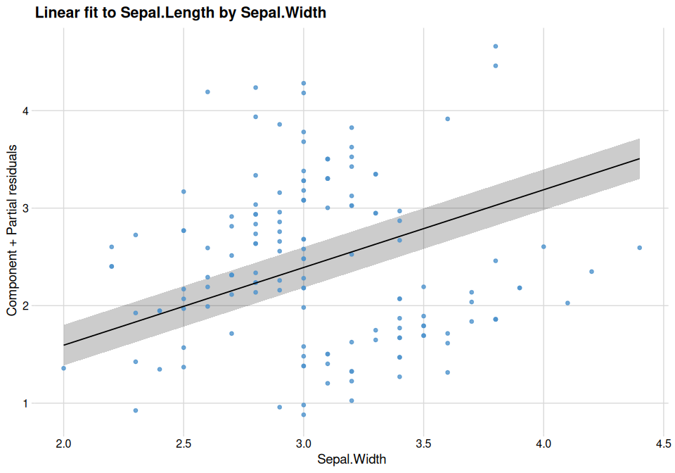

Expressing a random term (note that it is not “(1\|Species)”, just
“Species”):

``` r
express_one(lmm_1, iris, "Species")
```

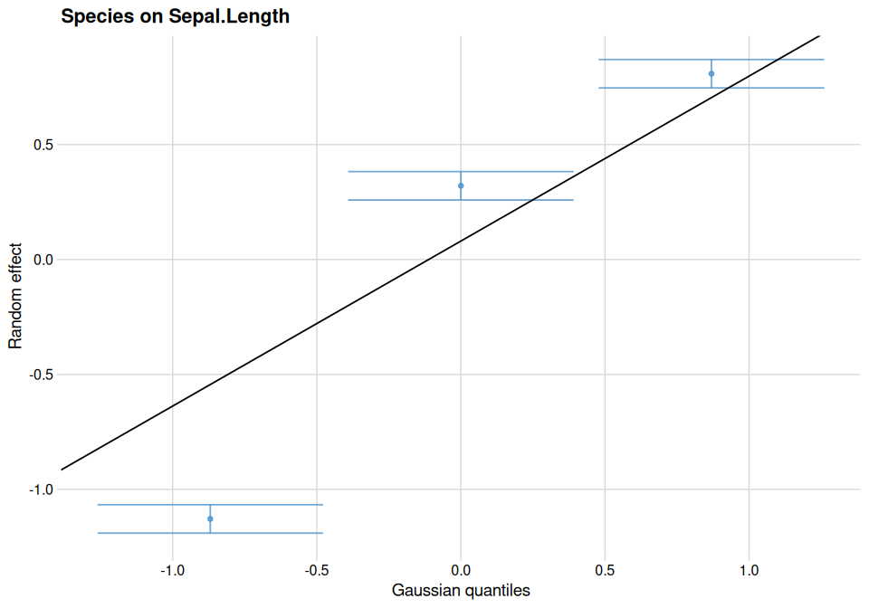

Expressing a random term with both an intercept and slope:

``` r
express_one(lmm_2, iris, "Species")
```

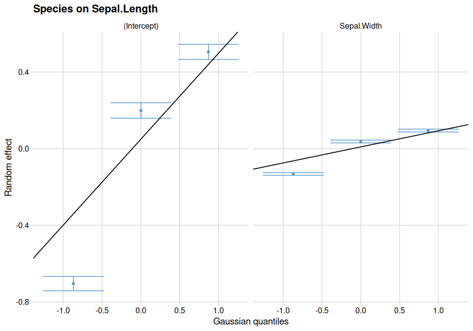

Expressing all components:

``` r
express_many(lmm_2, iris)
```

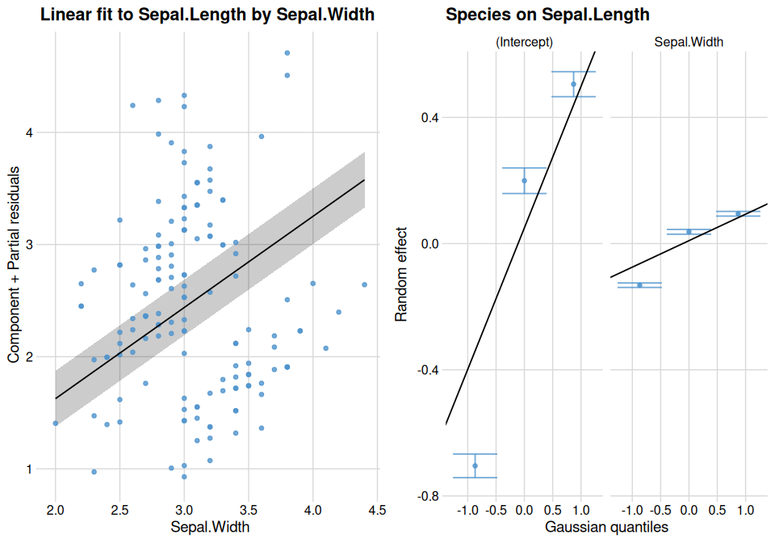

For LMMs, `express_eval()` is similar to the GAM method note that
`plot.lmerMod` returns a single plot of fitted values vs. residuals,
that is equivalent to `express_linpred()` and is included in the
evaluation.

``` r
express_eval(lmm_2, iris, by_covar = "Petal.Length")
```

    ## Cannot facet histogram by a continuous variable.
    ## A histogram or histograms will be returned without splitting by a covariate.

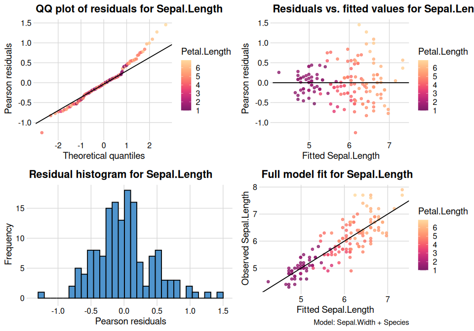

Gauging a full model:

``` r
express_gauge(lmm_2, iris, by_covar = "Petal.Length")
```

    ## $plots
    ## $plots$Sepal.Length_by_Petal.Length

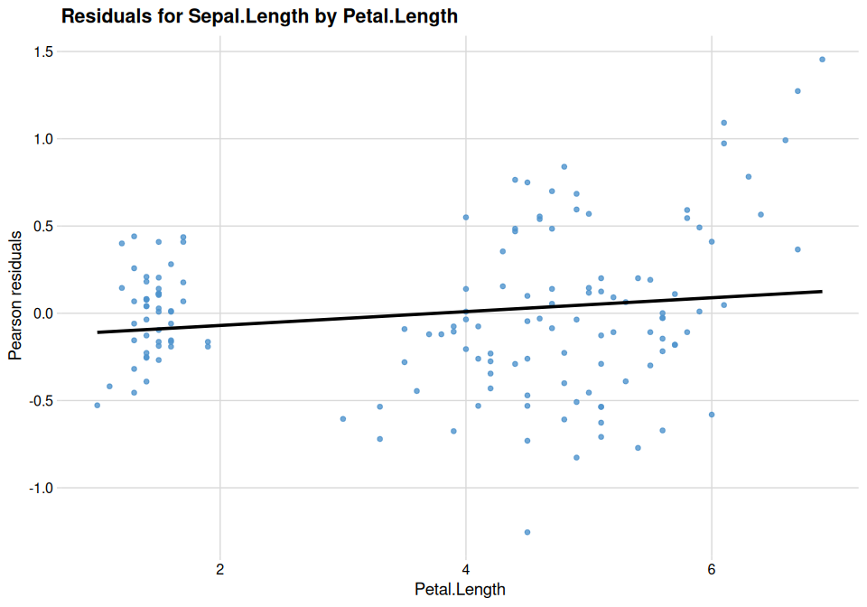

    ## 
    ## 
    ## $summaries
    ## $summaries$Sepal.Length_by_Petal.Length
    ## 
    ## Call:
    ## stats::lm(formula = stats::as.formula(transform), data = orig_data)
    ## 
    ## Residuals:
    ##      Min       1Q   Median       3Q      Max 
    ## -1.28408 -0.26561 -0.04537  0.24243  1.32996 
    ## 
    ## Coefficients:
    ##              Estimate Std. Error t value Pr(>|t|)  
    ## (Intercept)  -0.14908    0.08243  -1.809   0.0726 .
    ## Petal.Length  0.03967    0.01987   1.997   0.0477 *
    ## ---
    ## Signif. codes:  0 '***' 0.001 '**' 0.01 '*' 0.05 '.' 0.1 ' ' 1
    ## 
    ## Residual standard error: 0.4281 on 148 degrees of freedom
    ## Multiple R-squared:  0.02624,    Adjusted R-squared:  0.01966 
    ## F-statistic: 3.988 on 1 and 148 DF,  p-value: 0.04767

Gauging with LMMs is tricky because only the linear terms have partial
residuals. Instead, for random effect terms, the effects are compared
between another covariate or a factor, if the factor has fewer levels
than there are random effects.

``` r
express_gaugepart(lmm_2, iris, "Species", by_covar = "Petal.Length")
```

    ## $plots
    ## $plots$`Species:(Intercept)_on_Sepal.Length_by_Petal.Length`

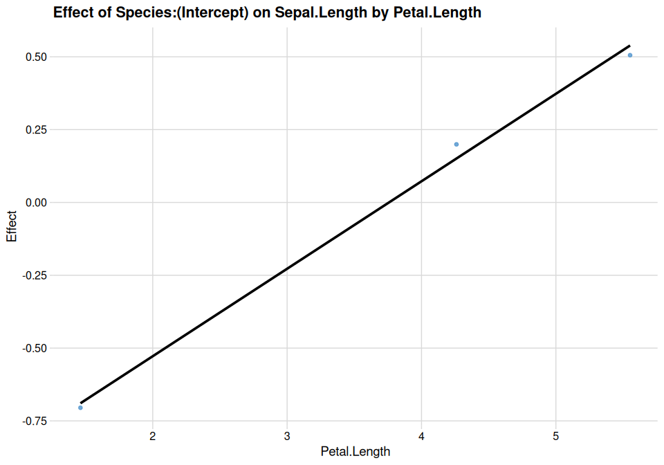

    ## 
    ## $plots$`Species:Sepal.Width_on_Sepal.Length_by_Petal.Length`

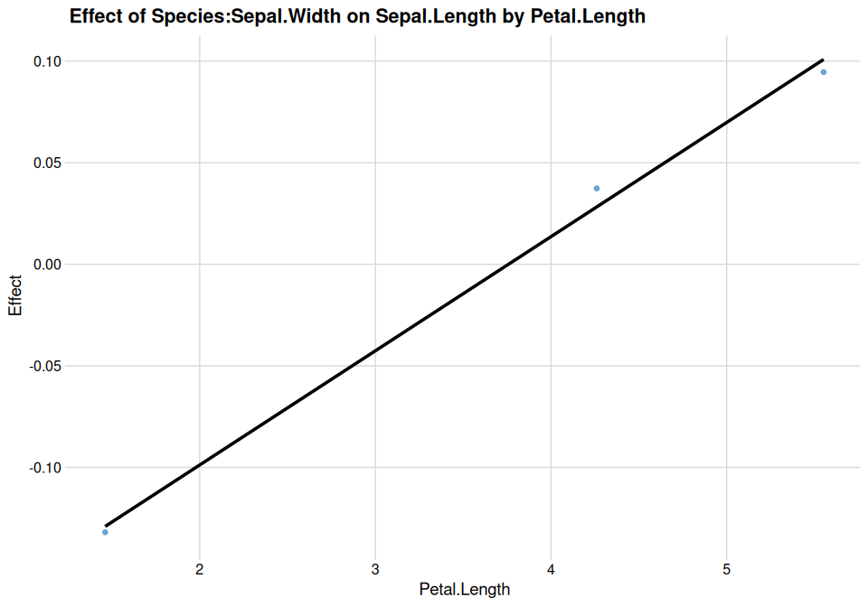

    ## 
    ## 
    ## $summaries
    ## $summaries$`Species:(Intercept)_on_Sepal.Length_by_Petal.Length`
    ## 
    ## Call:
    ## stats::lm(formula = stats::as.formula(transform), data = orig_data)
    ## 
    ## Residuals:
    ##        1        2        3 
    ## -0.01535  0.04860 -0.03325 
    ## 
    ## Coefficients:
    ##              Estimate Std. Error t value Pr(>|t|)  
    ## (Intercept)  -1.12829    0.08494  -13.28   0.0478 *
    ## Petal.Length  0.30024    0.02058   14.59   0.0436 *
    ## ---
    ## Signif. codes:  0 '***' 0.001 '**' 0.01 '*' 0.05 '.' 0.1 ' ' 1
    ## 
    ## Residual standard error: 0.06085 on 1 degrees of freedom
    ## Multiple R-squared:  0.9953, Adjusted R-squared:  0.9906 
    ## F-statistic: 212.8 on 1 and 1 DF,  p-value: 0.04357
    ## 
    ## 
    ## $summaries$`Species:Sepal.Width_on_Sepal.Length_by_Petal.Length`
    ## 
    ## Call:
    ## stats::lm(formula = stats::as.formula(transform), data = orig_data)
    ## 
    ## Residuals:
    ##         1         2         3 
    ## -0.002874  0.009097 -0.006223 
    ## 
    ## Coefficients:
    ##               Estimate Std. Error t value Pr(>|t|)  
    ## (Intercept)  -0.211205   0.015901  -13.28   0.0478 *
    ## Petal.Length  0.056201   0.003852   14.59   0.0436 *
    ## ---
    ## Signif. codes:  0 '***' 0.001 '**' 0.01 '*' 0.05 '.' 0.1 ' ' 1
    ## 
    ## Residual standard error: 0.01139 on 1 degrees of freedom
    ## Multiple R-squared:  0.9953, Adjusted R-squared:  0.9906 
    ## F-statistic: 212.8 on 1 and 1 DF,  p-value: 0.04357

------------------------------------------------------------------------

### Generalized linear mixed models

``` r
glmm_1 <- lme4::glmer(Sepal.Length ~ Sepal.Width + (1|Species),
                      data = iris,
                      family = inverse.gaussian(link = "log"))
```

Expressing one GLMM component:

``` r
express_one(glmm_1, iris, "Sepal.Width", by_covar = "Petal.Length")
```

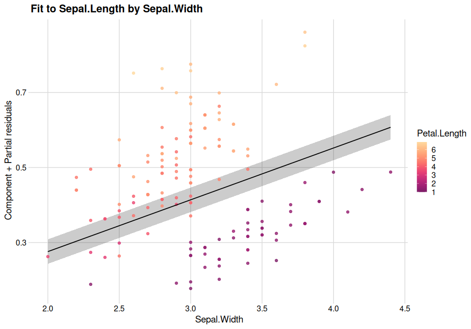

Expressing many GLMM components:

``` r
express_many(glmm_1, iris, by_covar = "Petal.Length")
```

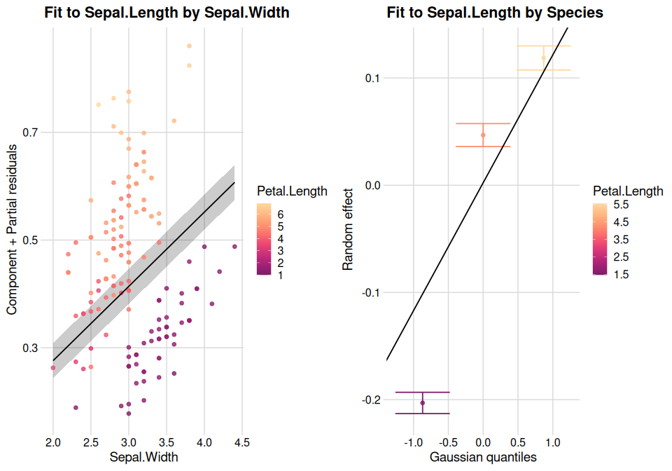

Evaluating a GLMM object by Species:

``` r
express_eval(glmm_1, iris, by_factor = "Species")
```

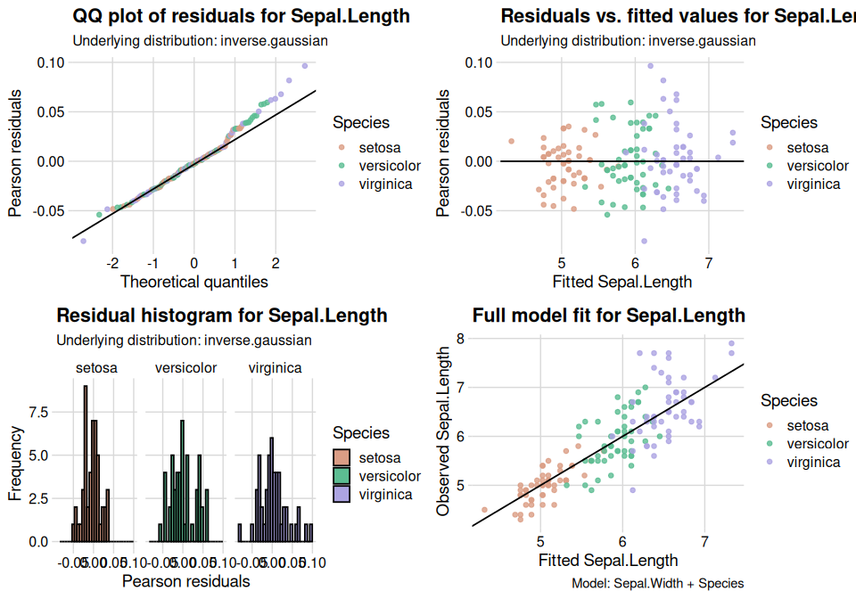

Gauging a full model:

``` r
express_gauge(glmm_1, iris, by_factor = "Species")
```

    ## $plots
    ## $plots$Sepal.Length_by_Species

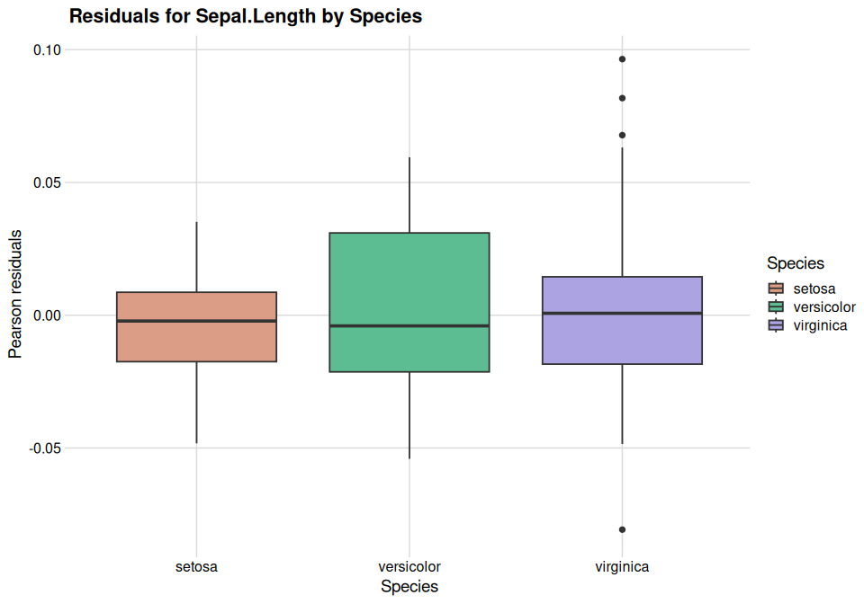

    ## 
    ## 
    ## $summaries
    ## $summaries$Sepal.Length_by_Species
    ##              Df  Sum Sq   Mean Sq F value Pr(>F)
    ## Species       2 0.00123 0.0006158   0.715  0.491
    ## Residuals   147 0.12653 0.0008608

Gauging a single model component:

``` r
express_gaugepart(glmm_1, iris, "Sepal.Width", by_covar = "Petal.Width")
```

    ## $plots
    ## $plots$Sepal.Width_on_Sepal.Length_by_Petal.Width

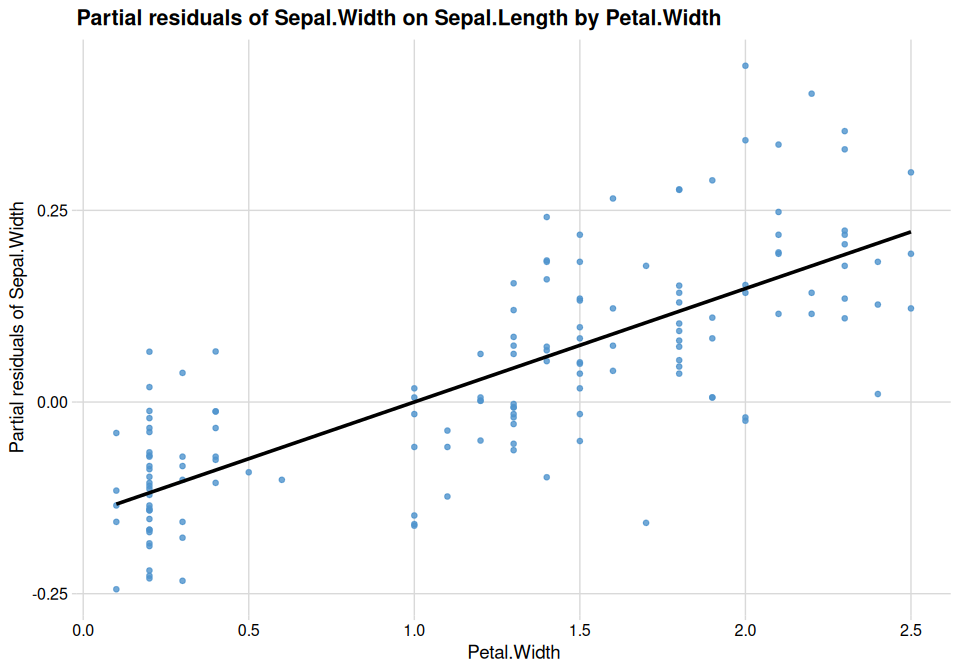

    ## 
    ## 
    ## $summaries
    ## $summaries$Sepal.Width_on_Sepal.Length_by_Petal.Width
    ## 
    ## Call:
    ## stats::lm(formula = stats::as.formula(transform), data = orig_data)
    ## 
    ## Residuals:
    ##      Min       1Q   Median       3Q      Max 
    ## -0.26123 -0.05529 -0.01033  0.04829  0.29062 
    ## 
    ## Coefficients:
    ##              Estimate Std. Error t value Pr(>|t|)    
    ## (Intercept) -0.147967   0.014008  -10.56   <2e-16 ***
    ## Petal.Width  0.147991   0.009867   15.00   <2e-16 ***
    ## ---
    ## Signif. codes:  0 '***' 0.001 '**' 0.01 '*' 0.05 '.' 0.1 ' ' 1
    ## 
    ## Residual standard error: 0.0918 on 148 degrees of freedom
    ## Multiple R-squared:  0.6032, Adjusted R-squared:  0.6005 
    ## F-statistic:   225 on 1 and 148 DF,  p-value: < 2.2e-16
